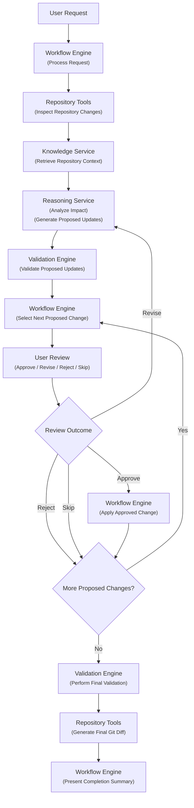

# Documentation Agent Architecture

**Version:** 0.2  
**Status:** Draft  
**Owner:** Project0  
**Last Updated:** 2026-08-01

------------------------------------------------------------------------

# 1. Purpose

## Objective

Define the high-level architecture of the Documentation Agent and the
major functional components required to satisfy the Documentation Agent
Functional Specification.

## Scope

Describe the architectural organization of the Documentation Agent.
Implementation details, algorithms, and technology selections are
intentionally excluded.

------------------------------------------------------------------------

# 2. Architectural Principles

- Modular component design.
- Single responsibility for each component.
- Deterministic components shall perform repository, workflow, and validation tasks whenever AI reasoning is not required.
- Repository content is the authoritative source of project knowledge.
- Human approval is required before documentation changes are applied.
- Components communicate through well-defined interfaces.
- Implementation technologies may change without affecting the architecture.

------------------------------------------------------------------------

# 3. Architectural Workflow

## Review Outcomes

Each proposed documentation change is reviewed individually.

- **Approve** — Apply the proposed change and continue to the next proposed change.
- **Revise** — Return the proposed change to the Reasoning Service for regeneration and subsequent validation.
- **Reject** — Discard the proposed change and continue to the next proposed change.
- **Skip** — Defer the proposed change without applying or rejecting it and continue to the next proposed change.

------------------------------------------------------------------------

# 4. Architectural Components

## Workflow Engine

Coordinates the overall documentation update workflow.

Responsibilities:

- Process user requests.
- Coordinate component interactions.
- Maintain workflow state.
- Manage the review sequence for individual proposed changes.
- Apply approved documentation changes.
- Continue processing until all proposed changes have been reviewed.
- Manage revision workflows.
- Present proposed updates, validation results, and completion summaries.

## Repository Tools

Provide deterministic access to the local Git repository.

Responsibilities:

- Inspect repository status.
- Retrieve repository changes.
- Read Markdown documents.
- Search repository content.
- Generate Git diffs.

## Knowledge Service

Provides repository knowledge required during analysis.

Responsibilities:

- Retrieve relevant repository documentation.
- Retrieve authoritative project information.
- Assemble repository context.
- Supply context to the Workflow Engine.

## Validation Engine

Verifies documentation quality before and after proposed updates.

Responsibilities:

- Validate Markdown.
- Validate documentation consistency.
- Validate links and referenced files.
- Validate MkDocs build.
- Produce validation reports.

## Reasoning Service

Provides AI reasoning capabilities through an abstract provider interface.

Responsibilities:

- Analyze repository changes and documentation impact.
- Generate proposed documentation updates.
- Explain proposed documentation changes.

------------------------------------------------------------------------

# 5. External Dependencies

The Documentation Agent interacts with:

- Local Git repository
- Markdown documentation
- Documentation standards
- MkDocs configuration
- Validation tools
- AI reasoning provider

------------------------------------------------------------------------

# 6. Design Constraints

- Markdown is the authoritative documentation format.
- Repository documentation is the source of truth.
- Documentation updates require individual approval.
- Proposed documentation updates shall remain non-authoritative until approved.
- Proposed documentation updates shall be validated before user approval.
- Applied documentation changes shall undergo final validation.
- Source code modification is outside the architectural scope.

------------------------------------------------------------------------

# 7. Future Architectural Expansion

Future versions may introduce:

- Dispatcher
- Multi-agent collaboration
- Repository event monitoring
- Incremental indexing
- Semantic repository services
- Additional LLM providers
- Additional validation services

------------------------------------------------------------------------

# 8. Related Documents

- Project Charter
- Documentation Standards
- Documentation Agent Functional Specification
- Implementation Roadmap
