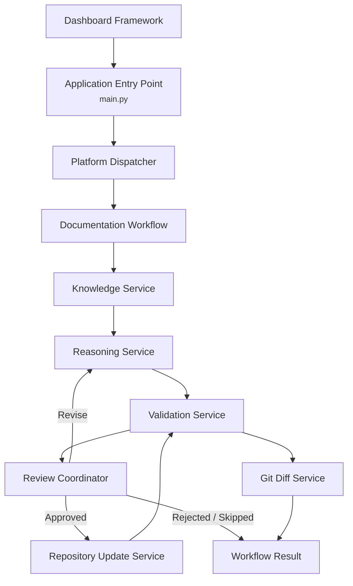

# Documentation Agent Architecture

**Version:** 0.4  
**Owner:** Project0  
**Last Updated:** 2026-08-06

---

## 1. Purpose

### Objective

Define the high-level architecture of the Documentation Agent and the
major functional components required to satisfy the Documentation Agent Functional Specification.

### Scope

Describe the architectural organization of the Documentation Agent.
Implementation details, algorithms, and technology selections are
intentionally excluded.

---

## 2. Architectural Principles

* Modular component design.
* Single responsibility for each component.
* Deterministic components shall perform repository, workflow, context, and validation tasks whenever AI reasoning is not required.
* Repository content is the authoritative source of project knowledge.
* Human approval is required before documentation changes are applied.
* Components communicate through well-defined typed interfaces.
* Shared data models define information exchanged between components.
* Platform components depend on interfaces rather than concrete implementations.
* Implementation technologies may change without affecting the architecture.

---

## 3. Architectural Workflow

The implemented platform provides an end-to-end documentation
workflow. The Documentation Agent is accessed through the reusable
Dashboard Framework, which provides the browser interface while
remaining architecturally separate from the Documentation Agent services.
The Dashboard Framework hosts the Documentation Agent user interface
within the Dashboard Work Area and integrates deterministic repository
knowledge, AI reasoning, validation, user review, approved repository
updates, and Git diff generation through the Platform Dispatcher.

### Implemented Runtime Flow

1. `dashboard_app.py` creates the Dashboard application and configured Documentation Agent UI services.
2. `main.py` creates the Platform Dispatcher.
3. The Platform Dispatcher dispatches the requested Documentation Workflow.
4. The Knowledge Service builds structured repository knowledge.
5. The Reasoning Service generates proposed documentation changes.
6. The Validation Service validates all proposed documentation changes.
7. The Review Coordinator processes each proposed change individually.
8. Approved changes are applied through the Repository Update Service.
9. Rejected and skipped changes continue without repository modification.
10. Revised changes return to the Reasoning Service for regeneration.
11. Approved repository updates undergo final validation.
12. The Git Diff Service generates a summary of applied repository changes.
13. The Documentation Workflow returns a structured Documentation Workflow Result.

---

## 4. Architectural Components

### Platform Dispatcher

Provides the platform-level entry point for executing workflows.

Responsibilities:

- Assemble the default platform services.
- Dispatch platform workflows.
- Create workflow tasks.
- Submit tasks to the Workflow Engine.
- Return structured workflow execution results.
- Dispatch Documentation Workflows.
- Assemble Documentation Workflow dependencies.

### Workflow Engine

Coordinates synchronous workflow task execution.

Responsibilities:

- Execute workflow tasks in sequence.
- Maintain workflow and task identifiers.
- Capture task outputs and failures.
- Stop workflow execution after the first failed task.
- Publish workflow and task events through an abstract interface.
- Return structured workflow execution results.

### Repository Service

Provides deterministic, read-only access to the local repository.

Responsibilities:

- Discover supported repository files.
- Discover Markdown documentation.
- Read individual repository files.
- Read multiple repository files.
- Exclude unsupported, generated, and hidden content.
- Return structured repository results and errors.

### Knowledge Service

Coordinates deterministic repository knowledge retrieval.

Responsibilities:

- Discover repository Markdown documentation.
- Parse repository documents.
- Build the in-memory document index.
- Invoke deterministic document selection.
- Coordinate context formatting.
- Preserve parsing and selection warnings.
- Return structured Knowledge Results.

### Document Parser

Parses Markdown documentation into structured repository models.

Responsibilities:

- Parse Markdown documents.
- Extract document metadata.
- Extract headings.
- Extract document links.
- Preserve repository paths.
- Return immutable Document Records.

### Document Index

Provides deterministic indexing of parsed repository documentation.

Responsibilities:

- Index parsed documents.
- Retrieve documents by repository path.
- Maintain deterministic document ordering.
- Detect duplicate document paths.

### Document Selector

Selects repository documentation relevant to a Knowledge Request.

Responsibilities:

- Evaluate explicit document requests.
- Match deterministic search terms.
- Apply required tag filtering.
- Apply changed-path matching.
- Include baseline project documentation when requested.
- Rank matching documents.
- Preserve deterministic ordering.
- Return Document Selections.

### Context Formatter

Formats selected repository documents into deterministic context.

Responsibilities:

- Format selected repository documents.
- Preserve document ordering.
- Produce deterministic prompt context.
- Avoid modification of repository content.

### Context Builder

Builds workflow-specific repository context.

Responsibilities:

- Discover available documentation through the Repository Interface.
- Request context criteria from the Context Rule Registry.
- Apply deterministic context filtering.
- Read selected repository documents.
- Preserve repository file metadata.
- Produce structured Context Packages.
- Preserve partial results and report read warnings.

### Context Rule Registry

Defines document-selection policies for supported workflow types.

Responsibilities:

- Maintain workflow-specific Context Rules.
- Resolve rules by workflow type.
- Convert Context Rules into Context Filter criteria.
- Provide default rules for general documentation, documentation updates, component implementation, and documentation validation.

### Context Filter

Applies deterministic file-selection criteria.

Responsibilities:

- Filter by documentation status.
- Filter by file extension.
- Apply included and excluded paths.
- Apply included and excluded filename patterns.
- Normalize repository paths.
- Return files in deterministic order.

### Shared Interfaces

Define stable contracts between platform components.

Implemented interfaces:

- Repository Interface
- Workflow Interface
- Workflow Event Publisher Interface
- Context Builder Interface
- Knowledge Interface
- Validation Interface
- Validator Interface
- Documentation Workflow Interface
- Review Coordinator Interface
- Repository Update Interface
- Git Diff Interface

Interfaces allow components to depend on required capabilities rather than concrete implementations.

### Shared Data Models

Define immutable data exchanged between platform components.

Implemented model groups:

- Context workflow types
- Context requests
- Context documents
- Context packages
- Knowledge requests
- Document records
- Document headings
- Document links
- Document selections
- Document references
- Knowledge results
- Validation requests
- Validation issues
- Validator results
- Validation results
- Workflow and task statuses
- Workflow tasks
- Task execution results
- Workflow execution results
- Documentation workflow requests
- Documentation workflow results
- Documentation change proposals
- Documentation reviews
- Applied documentation changes
- Documentation workflow summaries

### Validation Service

Coordinates deterministic repository validation.

Responsibilities:

- Coordinate all configured validators.
- Aggregate validator results.
- Preserve validator execution order.
- Isolate validator execution failures.
- Produce immutable Validation Results.

Implemented validators:

- Markdown Validator
- Link Validator
- MkDocs Validator
- Documentation Consistency Validator

Validation components communicate through the Validation Interface and exchange immutable Validation Models.

### Reasoning Service

Provides AI reasoning through an abstract provider interface.

Responsibilities:

- Analyze repository changes and documentation impact.
- Generate proposed documentation updates.
- Explain proposed documentation changes.

The Reasoning Service is implemented and integrated into the Documentation Workflow through an abstract provider interface.

---

### Review Coordinator

Coordinates user review of individual proposed documentation changes.

Responsibilities:

- Present individual proposed documentation changes.
- Process Approve, Revise, Reject, and Skip decisions.
- Return immutable review results.

---

### Repository Update Service

Applies approved documentation changes.

Responsibilities:

- Apply approved Markdown updates.
- Preserve repository integrity.
- Report update results.
- Produce immutable application results.

---

### Git Diff Service

Produces Git-based summaries of approved repository changes.

Responsibilities:

- Generate repository diffs.
- Restrict diffs to affected files.
- Report Git execution failures.
- Preserve deterministic output.

---

### Documentation Workflow

Coordinates the complete Documentation Agent execution pipeline.

Responsibilities:

- Coordinate Knowledge, Reasoning, Validation, Review, Repository Update, and Git Diff services.
- Preserve workflow state.
- Produce immutable Documentation Workflow Results.

---

## 5. External Dependencies

The Documentation Agent interacts with:

- Local Git repository
- Markdown documentation
- Documentation standards
- MkDocs configuration
- Python runtime environment
- pytest test framework
- Validation tools
- AI reasoning provider
- Dashboard Framework (FastAPI, Jinja2 templates, shared dashboard resources)

---

## 6. Design Constraints

- Markdown is the authoritative documentation format.
- Repository documentation is the source of truth.
- Platform components shall communicate through typed interfaces.
- Shared data models shall define information exchanged between components.
- Platform components shall depend on interfaces rather than concrete implementations where practical.
- Documentation updates require individual approval.
- Proposed documentation updates shall remain non-authoritative until approved.
- Proposed documentation updates shall be validated before user approval.
- Applied documentation changes shall undergo final validation.
- Current repository operations are read-only.
- Source code modification by the Documentation Agent is outside the current architectural scope.
- The Dashboard Framework shall remain a reusable platform interface and shall not contain Documentation Agent business logic.
- Agent user interfaces shall render within Dashboard Work Areas rather than operating as independent applications.

---

## 7. Future Architectural Expansion

Future versions may introduce:

- Documentation Agent reasoning
- Multi-agent collaboration
- Repository event monitoring
- Semantic document retrieval
- Embedding generation
- Vector-based repository search
- Semantic repository services
- Additional AI providers
- Additional validation services
- Asynchronous workflow execution

---

## 8. Related Documents

- Project Charter
- Documentation Standards
- Documentation Agent Functional Specification
- Documentation Agent Design
- Component Communication Design
- Shared Data Models and Error Contracts
- Implementation Roadmap
- Implementation Status
- Project Directory Structure

