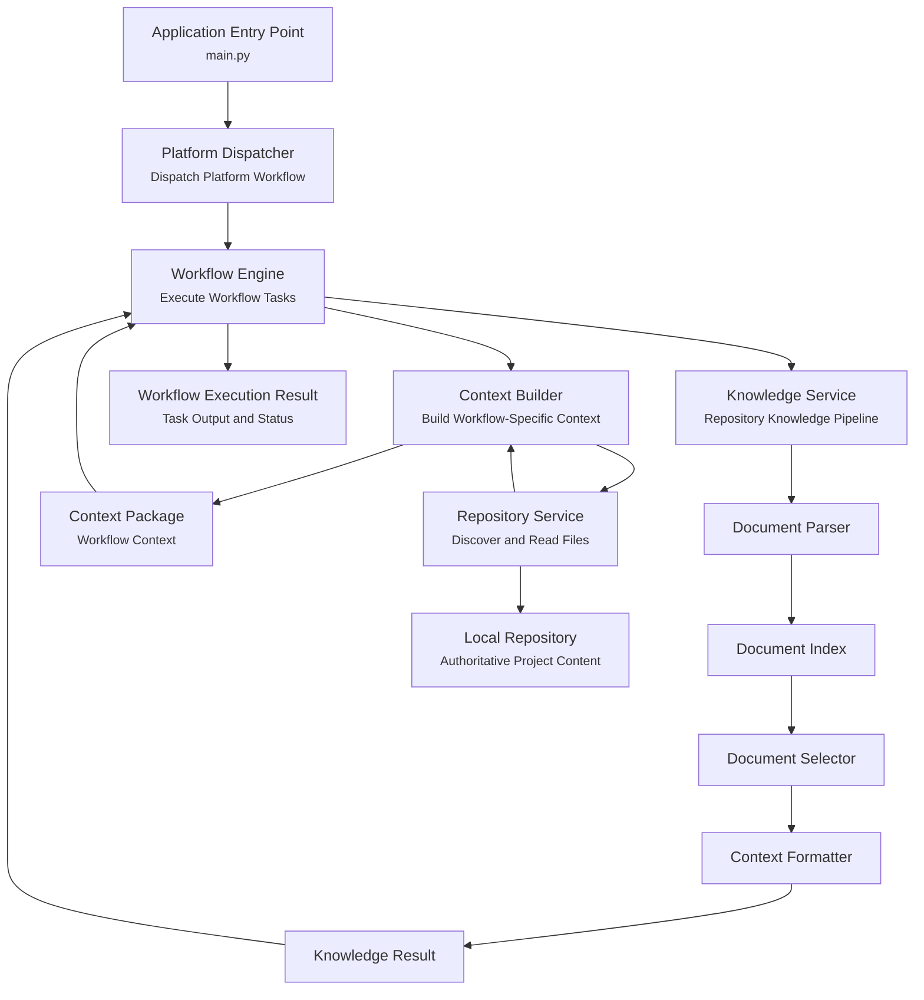

# Documentation Agent Architecture

**Version:** 0.3  
**Owner:** Project0  
**Last Updated:** 2026-08-04

---

# 1. Purpose

## Objective

Define the high-level architecture of the Documentation Agent and the
major functional components required to satisfy the Documentation Agent Functional Specification.

## Scope

Describe the architectural organization of the Documentation Agent.
Implementation details, algorithms, and technology selections are
intentionally excluded.

---

# 2. Architectural Principles

* Modular component design.
* Single responsibility for each component.
* Deterministic components shall perform repository, workflow, context, and validation tasks whenever AI reasoning is not required.
* Repository content is the authoritative source of project knowledge.
* Human approval is required before documentation changes are applied.
* Components communicate through well-defined typed interfaces.
* Shared data models define information exchanged between components.
* Platform components depend on interfaces rather than concrete implementations.
* Implementation technologies may change without affecting the architecture.

---

# 3. Architectural Workflow

The implemented Phase 3 platform provides the deterministic repository knowledge foundation for future Documentation Agent workflows.

## Implemented Runtime Flow

1. `main.py` creates the Platform Dispatcher.
2. The Platform Dispatcher creates a workflow task.
3. The Workflow Engine executes the task.
4. The Context Builder constructs workflow-specific repository context.
5. The Repository Service discovers and reads repository content.
6. The Context Builder returns a Context Package.
7. The Workflow Engine invokes the Knowledge Service when structured repository knowledge is required.
8. The Knowledge Service parses repository documents.
9. Parsed documents are indexed.
10. The Document Selector identifies the most relevant repository documents.
11. The Context Formatter produces deterministic formatted context.
12. The Knowledge Service returns a Knowledge Result.
13. The Workflow Engine returns a Workflow Execution Result.

## Future Documentation Update Workflow

Future phases will extend the implemented platform with AI reasoning, validation, individual change review, approved repository updates, final validation, and completion reporting.

Each proposed documentation change will support the following review outcomes:

* **Approve** — Apply the proposed change and continue to the next proposed change.
* **Revise** — Return the proposed change for regeneration and subsequent validation.
* **Reject** — Discard the proposed change and continue to the next proposed change.
* **Skip** — Defer the proposed change and continue to the next proposed change.

---

# 4. Architectural Components

## Platform Dispatcher

Provides the platform-level entry point for executing workflows.

Responsibilities:

- Assemble the default platform services.
- Dispatch platform workflows.
- Create workflow tasks.
- Submit tasks to the Workflow Engine.
- Return structured workflow execution results.

## Workflow Engine

Coordinates synchronous workflow task execution.

Responsibilities:

- Execute workflow tasks in sequence.
- Maintain workflow and task identifiers.
- Capture task outputs and failures.
- Stop workflow execution after the first failed task.
- Publish workflow and task events through an abstract interface.
- Return structured workflow execution results.

## Repository Service

Provides deterministic, read-only access to the local repository.

Responsibilities:

- Discover supported repository files.
- Discover Markdown documentation.
- Read individual repository files.
- Read multiple repository files.
- Exclude unsupported, generated, and hidden content.
- Return structured repository results and errors.

## Knowledge Service

Coordinates deterministic repository knowledge retrieval.

Responsibilities:

- Discover repository Markdown documentation.
- Parse repository documents.
- Build the in-memory document index.
- Invoke deterministic document selection.
- Coordinate context formatting.
- Preserve parsing and selection warnings.
- Return structured Knowledge Results.

## Document Parser

Parses Markdown documentation into structured repository models.

Responsibilities:

- Parse Markdown documents.
- Extract document metadata.
- Extract headings.
- Extract document links.
- Preserve repository paths.
- Return immutable Document Records.

## Document Index

Provides deterministic indexing of parsed repository documentation.

Responsibilities:

- Index parsed documents.
- Retrieve documents by repository path.
- Maintain deterministic document ordering.
- Detect duplicate document paths.

## Document Selector

Selects repository documentation relevant to a Knowledge Request.

Responsibilities:

- Evaluate explicit document requests.
- Match deterministic search terms.
- Apply required tag filtering.
- Apply changed-path matching.
- Include baseline project documentation when requested.
- Rank matching documents.
- Preserve deterministic ordering.
- Return Document Selections.

## Context Formatter

Formats selected repository documents into deterministic context.

Responsibilities:

- Format selected repository documents.
- Preserve document ordering.
- Produce deterministic prompt context.
- Avoid modification of repository content.

## Context Builder

Builds workflow-specific repository context.

Responsibilities:

- Discover available documentation through the Repository Interface.
- Request context criteria from the Context Rule Registry.
- Apply deterministic context filtering.
- Read selected repository documents.
- Preserve repository file metadata.
- Produce structured Context Packages.
- Preserve partial results and report read warnings.

## Context Rule Registry

Defines document-selection policies for supported workflow types.

Responsibilities:

- Maintain workflow-specific Context Rules.
- Resolve rules by workflow type.
- Convert Context Rules into Context Filter criteria.
- Provide default rules for general documentation, documentation updates, component implementation, and documentation validation.

## Context Filter

Applies deterministic file-selection criteria.

Responsibilities:

- Filter by documentation status.
- Filter by file extension.
- Apply included and excluded paths.
- Apply included and excluded filename patterns.
- Normalize repository paths.
- Return files in deterministic order.

## Shared Interfaces

Define stable contracts between platform components.

Implemented interfaces:

- Repository Interface
- Workflow Interface
- Workflow Event Publisher Interface
- Context Builder Interface
- Knowledge Interface

Interfaces allow components to depend on required capabilities rather than concrete implementations.

## Shared Data Models

Define immutable data exchanged between platform components.

Implemented model groups:

- Context workflow types
- Context requests
- Context documents
- Context packages
- Knowledge requests
- Document records
- Document headings
- Document links
- Document selections
- Document references
- Knowledge results
- Workflow and task statuses
- Workflow tasks
- Task execution results
- Workflow execution results

## Validation Engine

Verifies documentation quality before and after proposed updates.

Responsibilities:

- Validate Markdown.
- Validate documentation consistency.
- Validate links and referenced files.
- Validate MkDocs builds.
- Produce validation reports.

The Validation Engine is planned for a future implementation phase.

## Reasoning Service

Provides AI reasoning through an abstract provider interface.

Responsibilities:

- Analyze repository changes and documentation impact.
- Generate proposed documentation updates.
- Explain proposed documentation changes.

The Reasoning Service is planned for a future implementation phase.

---

# 5. External Dependencies

The Documentation Agent interacts with:

- Local Git repository
- Markdown documentation
- Documentation standards
- MkDocs configuration
- Python runtime environment
- pytest test framework
- Validation tools
- AI reasoning provider

---

# 6. Design Constraints

- Markdown is the authoritative documentation format.
- Repository documentation is the source of truth.
- Platform components shall communicate through typed interfaces.
- Shared data models shall define information exchanged between components.
- Platform components shall depend on interfaces rather than concrete implementations where practical.
- Documentation updates require individual approval.
- Proposed documentation updates shall remain non-authoritative until approved.
- Proposed documentation updates shall be validated before user approval.
- Applied documentation changes shall undergo final validation.
- Current repository operations are read-only.
- Source code modification by the Documentation Agent is outside the current architectural scope.

---

# 7. Future Architectural Expansion

Future versions may introduce:

- Documentation Agent reasoning
- Validation Engine implementation
- User review and approval workflow
- Controlled repository modification
- Final Git diff generation
- Multi-agent collaboration
- Repository event monitoring
- Semantic document retrieval
- Embedding generation
- Vector-based repository search
- Semantic repository services
- Additional AI providers
- Additional validation services
- Asynchronous workflow execution

---

# 8. Related Documents

- Project Charter
- Documentation Standards
- Documentation Agent Functional Specification
- Documentation Agent Design
- Component Communication Design
- Shared Data Models and Error Contracts
- Implementation Roadmap
- Implementation Status
- Project Directory Structure

