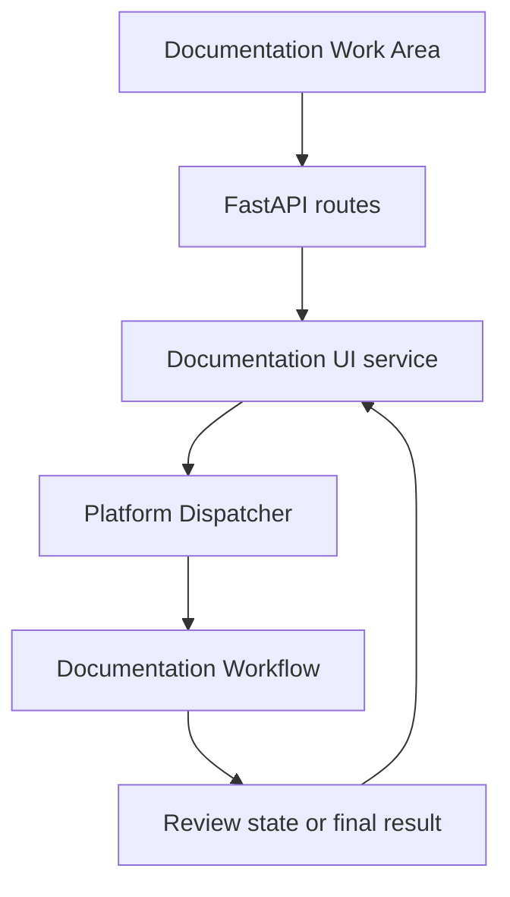
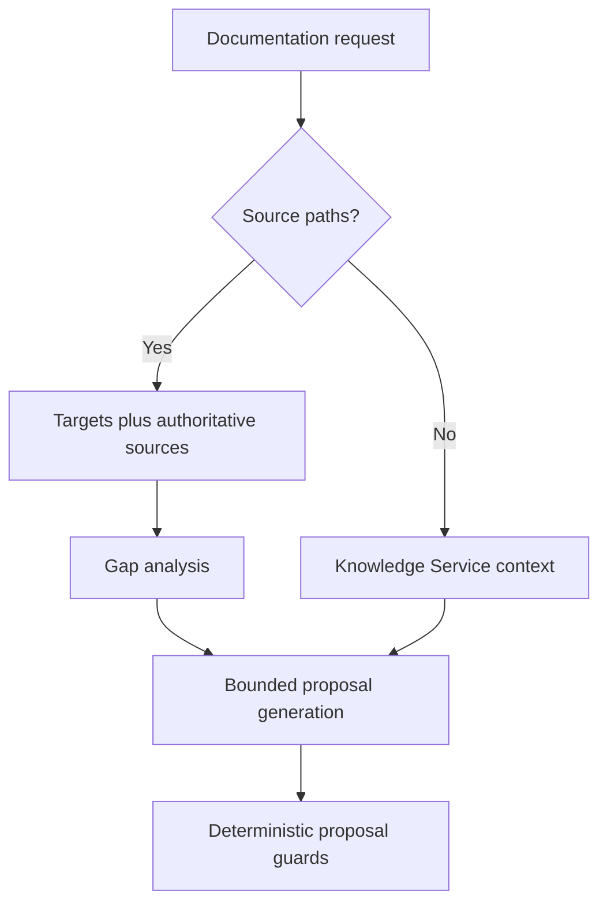
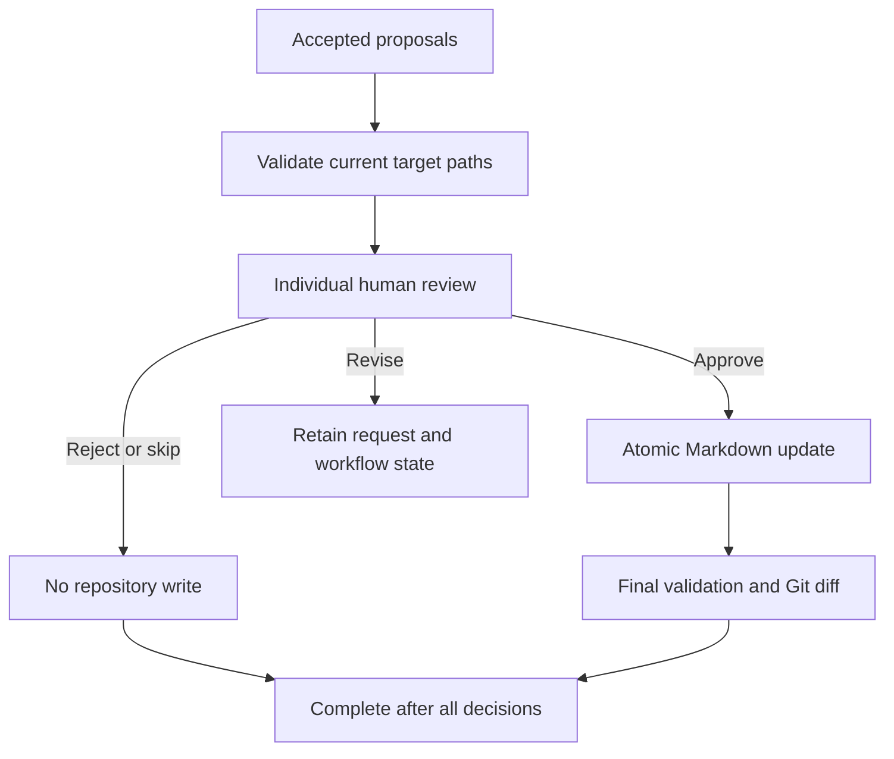

# Documentation Agent Architecture

**Version:** 0.7  
**Owner:** Project0  
**Last Updated:** 2026-09-11

---

## 1. Purpose

### Objective

Define the high-level architecture of the Documentation Agent and the
major components that implement its source-grounded, human-reviewed
Markdown update workflow.

### Scope

This document describes architectural organization, responsibility
boundaries, principal data flow, runtime composition, dependencies, and
constraints. Detailed algorithms and exact model fields belong in the
Documentation Agent Design and Interface Design documents.

---

## 2. Architectural Principles

- **Modular responsibility**: Repository access, context construction,
  reasoning, artifact location, validation, review presentation,
  repository update, and Git diff generation remain separate concerns.
- **Repository grounding**: Explicitly supplied source files are
  read-only authoritative evidence for source-grounded synchronization.
- **Controlled target artifacts**: Existing Markdown target files are
  updated in place; the executable workflow does not create or delete
  files.
- **Deterministic enforcement**: Path, operation, file-type, location,
  semantic-alignment, anchor, and source-fidelity rules are enforced
  outside the reasoning provider.
- **Human authority**: A proposal must receive an individual approve
  decision before it can be written.
- **Typed boundaries**: Components exchange typed request, result,
  proposal, review, validation, and presentation models.
- **Provider abstraction**: Reasoning services depend on a provider
  protocol rather than a specific model runtime.
- **Shared platform reuse**: Agent-specific behavior composes reusable
  Project0 services without moving that behavior into the shared
  Dashboard shell.
- **Fail-closed behavior**: Ambiguous or unsupported source-grounded
  proposals are skipped and reported instead of being applied by best
  effort.

---

## 3. Architectural Workflow

### 3.1 Browser and platform flow

The Documentation Agent is hosted inside the Project0 Dashboard. Its
FastAPI router accepts requests and individual review decisions. The UI
service normalizes browser values, calls the Platform Dispatcher, and
maps workflow objects into presentation models.

The Platform Dispatcher invokes `DocumentationWorkflow` directly. The
generic `WorkflowEngine` is assembled as a shared platform service but
is not the execution engine for the current Documentation Workflow.

### 3.2 Context and reasoning paths

The workflow has two context paths:

1. **Source-grounded path**: When source paths are supplied, the
   repository service reads only the requested target and source files.
   Context explicitly labels each file as `TARGET DOCUMENTATION` or
   `AUTHORITATIVE SOURCE`. Any read error prevents context construction.
2. **Ordinary path**: Without source paths, the Knowledge Service builds
   context from the user request and optional requested target paths.
   Baseline documents are not automatically included by this path.

Source-grounded execution uses two reasoning calls. The first returns
material documentation gaps; exact duplicate gaps are removed. The
second generates edits only for the established gaps and receives the
repository-local `strict-documentation-editor` skill when the Skill
Registry is configured. Ordinary execution uses one documentation
update reasoning call.

### 3.3 Proposal, validation, and review flow

Structured provider output is parsed by `ReasoningService`. The
Documentation Workflow then converts supported changes into reviewable
proposals. Only updates to existing `.md` files inside the repository
and optional target allowlist are eligible.

Source-grounded proposals receive additional deterministic checks for
concrete Markdown content, fenced Python use, declaration fidelity,
unique locations or anchors, and section semantic alignment. Failed
checks produce warnings and skipped proposals.

The configured Validation Service validates proposal target paths before
review. This preliminary validation evaluates the current repository
files; it does not apply each proposed edit to an isolated validation
workspace.

The workflow stores review state in memory by workflow identifier. Each
proposal accepts approve, revise, reject, or skip:

- approve immediately invokes the Repository Update Service;
- reject and skip produce skipped application records without writes;
- revise retains state and returns control to the user, but does not
  automatically invoke reasoning again.

After every proposal has a decision, the workflow validates successfully
applied paths, generates their Git diff, builds summary counters, returns
a final result, and removes the in-memory state.

---

## 4. Architectural Components

### Documentation Agent Routes

Expose the Documentation Work Area, request submission, and review
submission endpoints. Routes parse newline-separated paths, convert
review decision strings, delegate blocking workflow calls through the
thread pool, and render the shared Dashboard shell.

### Documentation Agent UI Service

Acts as the browser adapter. It normalizes request fields, invokes the
dispatcher-facing workflow port, converts domain models to immutable
view models, constructs focused proposal differences using the same
change-application helper used by repository updates, and maps errors to
displayable failure states.

### Platform Dispatcher

Provides the application-level entry points for running documentation
workflows, submitting reviews, and retrieving workflow state. It
validates required top-level values and assembles default platform and
agent dependencies.

### Repository Service

Provides deterministic repository discovery and file reads. For
source-grounded work it reads the exact target and source path set and
preserves repository-relative identity and read errors.

### Knowledge Service

Builds documentation context for requests without authoritative source
paths. It performs repository document discovery, parsing, deterministic
selection, and formatting through its knowledge-layer collaborators.

### Reasoning Service and Prompt Builder

Build schema-constrained provider requests and parse provider-neutral
structured output. The Prompt Builder separates system instructions,
workflow rules, allowed paths and sections, active skill instructions,
and repository context. The Reasoning Service converts provider output
into typed gaps, impacts, and proposed changes or a failed reasoning
result.

### Reasoning Provider

Executes the provider request. The production path supports local
Ollama through `/api/chat`, non-streaming JSON-schema output, temperature
0.0, and configurable timeout. Stub mode supplies deterministic output
for development and tests. Documentation and Research dispatchers may
share an Ollama provider while using different model names.

### Skill Registry

Discovers and loads repository-local skills beneath `skills/`. The
Documentation Workflow conditionally loads
`strict-documentation-editor` for source-grounded proposal generation.
Skill instructions refine model behavior; deterministic workflow guards
remain authoritative and independent of the skill.

### Artifact Location Service

Finds existing Markdown sections and other precise ranges used to
anchor localized changes. Location results are advisory inputs to
deterministic ambiguity and semantic-alignment checks before a proposal
is accepted.

### Documentation Workflow

Owns orchestration of context acquisition, one- or two-stage reasoning,
gap deduplication, proposal construction and filtering, preliminary
validation, in-memory review state, per-proposal application, final
validation, Git diff generation, warnings, statuses, and summaries.

### Validation Service

Runs configured validators in order, isolates validator exceptions, and
aggregates issues and status. The default Documentation Workflow is
assembled with:

- Markdown Validator;
- Link Validator; and
- MkDocs Validator.

The Documentation Consistency Validator exists elsewhere in the
platform but is not included in the default Documentation Workflow's
validator tuple at the pinned implementation.

### Review Coordinator

Defines a reusable decision-provider abstraction and is injected into
the Documentation Workflow. Interactive Dashboard review, however,
calls `DocumentationWorkflow.submit_review()` through the Platform
Dispatcher; the stored coordinator is not invoked by that current path.
It should therefore not be described as automatically regenerating
revised proposals or mediating browser decisions.

### Repository Update Service

Applies one approved proposal. It verifies matching proposal and review
identifiers, repository containment, Markdown type, file existence, and
the original-content snapshot. Successful writes use a temporary file
in the destination directory followed by atomic replacement.

### Git Diff Service

Generates a Git diff limited to successfully applied paths. It reports
repository differences but does not commit, stage, push, branch, merge,
or open pull requests.

### Shared Models and Interfaces

Typed contracts cover repository access, context, reasoning providers,
validation, workflow execution, documentation workflow operations,
artifact locations, review, repository update, and Git diff generation.
Domain workflow models remain separate from browser presentation models.

---

## 5. Runtime Composition and External Dependencies

`create_project0_dashboard_app()` constructs separate Documentation and
Research dispatchers and supplies their UI services to the shared
Dashboard application.

When `PROJECT0_REASONING_PROVIDER=ollama`, both dispatchers use the
configured Ollama provider and agent-specific model names. The
Documentation model resolves from `PROJECT0_DOCUMENTATION_OLLAMA_MODEL`,
then `PROJECT0_OLLAMA_MODEL`, with `gemma3:4b` as its default. When the
provider is `stub`, the Dashboard supplies separate deterministic
Documentation and Research reasoning providers.

Principal external dependencies are:

- a local Git repository;
- Markdown documentation and optional Python or other source evidence;
- `mkdocs.yml` and locally resolvable documentation links;
- the Python runtime and Project0 application packages;
- FastAPI, Starlette, and Jinja2 for the browser interface;
- Git for final diff generation;
- a local Ollama service when Ollama reasoning is selected; and
- pytest and browser-test dependencies for verification.

---

## 6. Data, State, and Failure Boundaries

### Data boundaries

The principal Documentation Agent model groups are:

- documentation workflow requests and statuses;
- source-grounded gaps, impacts, and proposed reasoning changes;
- accepted documentation change proposals;
- individual reviews and application results;
- preliminary and final validation results;
- workflow state, summaries, and final results; and
- page, proposal, difference, validation, and summary view models.

Provider output is treated as untrusted structured input. Parsing
precedes deterministic proposal enforcement, and proposal enforcement
precedes human review.

### State and mutation boundaries

Review state is stored only in the Documentation Workflow process. It is
not durable across application restarts or shared across independent
processes.

Approval is immediately mutating for that proposal. Earlier approvals
can therefore be present in the working tree while later proposals still
await decisions. The proposal set is not a transaction.

Final validation occurs after writing. A failed final validation result
is reported and influences workflow status, but the implementation does
not automatically restore the original document.

### Failure behavior

- Context read failures abort source-grounded context construction.
- Provider, parsing, expected I/O, runtime, type, and value failures are
  converted into failed reasoning or workflow results where handled.
- Invalid individual proposals are generally skipped with warnings.
- Validator exceptions become failed validator results with error
  issues.
- A stale target snapshot produces a failed application result.
- Unknown workflow IDs, unknown proposal IDs, duplicate reviews, and
  unsupported review decisions are rejected.

---

## 7. Architectural Constraints and Future Expansion

### Current constraints

- Only existing Markdown files can be updated by the workflow.
- Source-grounded context is limited to explicitly supplied target and
  source paths.
- Preliminary validation evaluates current target files rather than a
  staged candidate tree.
- Review state is in memory.
- Review decisions are processed one proposal at a time.
- Revise does not automatically regenerate a proposal.
- Approved writes are atomic per file but not transactional across
  proposals.
- Final validation has no rollback mechanism.
- The default Documentation Workflow uses Markdown, link, and MkDocs
  validators, not the Documentation Consistency Validator.
- The workflow does not perform Git publication operations.

### Possible future expansion

Future versions may introduce durable workflow state, candidate-tree
validation, automatic revision loops, transactional rollback, controlled
document creation or deletion, semantic retrieval, repository-event
awareness, asynchronous execution, additional reasoning providers, and
multi-agent coordination.

These items are architectural possibilities, not current capabilities.
They require corresponding implementation, tests, and documentation
updates before being treated as supported behavior.

---

**End of Document**
