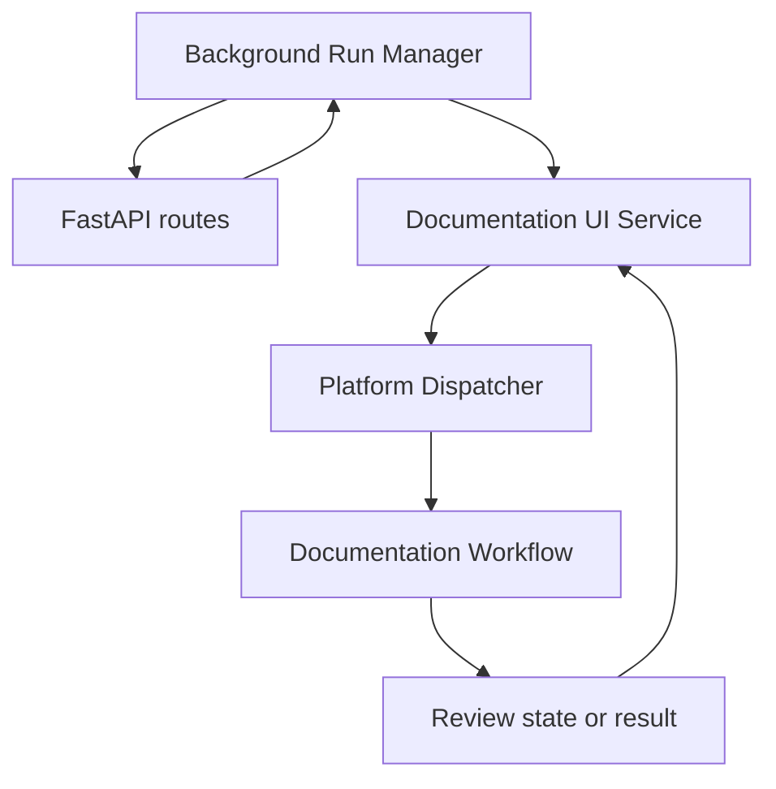
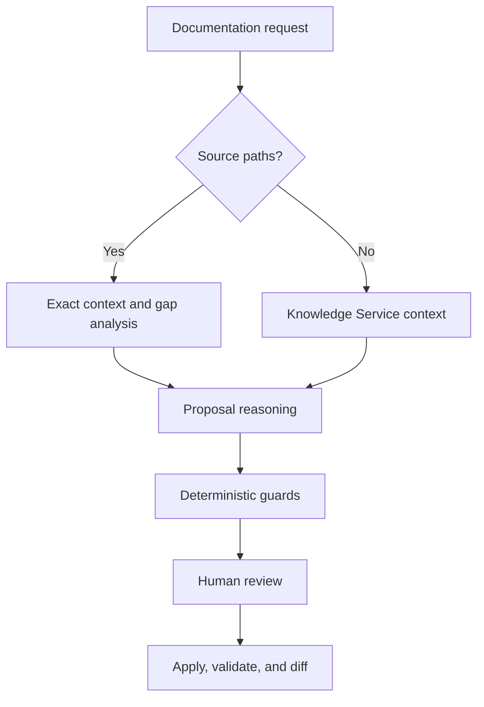

# Documentation Agent Architecture

**Version:** 0.9  
**Owner:** Project0  
**Last Updated:** 2026-09-18

## 1. Executive Summary

The Documentation Agent is a source-grounded, human-reviewed Markdown update workflow hosted by the shared Project0 Dashboard. It composes separate repository, context, reasoning, location, validation, review, update, and Git-diff services behind typed boundaries. Reasoning proposes changes; deterministic guards establish eligibility and location; individual human approval authorizes each write. Approved files are replaced atomically, but the proposal set is not transactional and failed final validation does not roll back a completed write.

## 2. Purpose and Scope

This document defines the Documentation Agent's architecture, major components, runtime composition, dependencies, data flow, and constraints. Algorithms and exact model fields belong in the Documentation Agent Design and Interface Design.

The architecture keeps agent-specific workflow and presentation behavior outside the shared Dashboard shell. It treats supplied source files as read-only evidence, existing Markdown targets as controlled artifacts, provider output as untrusted structured input, and ambiguous source-grounded proposals as warnings rather than best-effort writes.

## 3. Architecture and Components

### Runtime topology

The Dashboard router accepts requests and individual review decisions, submits valid operations to the shared background-run manager, and immediately redirects the browser to a run page. The UI Service normalizes browser values, invokes the Platform Dispatcher, and maps workflow objects into presentation models. The dispatcher calls `DocumentationWorkflow` directly; the assembled generic `WorkflowEngine` is not its current execution engine.

`create_project0_dashboard_app()` constructs separate Documentation and Research dispatchers. In Ollama mode they may share a provider while using agent-specific model names. The Documentation model resolves from `PROJECT0_DOCUMENTATION_OLLAMA_MODEL`, then `PROJECT0_OLLAMA_MODEL`, with `gemma3:4b` as default. Stub mode supplies separate deterministic providers.

### Browser and orchestration components

- **Documentation Agent Routes** expose the Work Area, request, review, run, and run-status endpoints; parse newline-separated paths and decisions; enqueue valid workflow operations; return `303` redirects; and render processing or retained final page state.
- **Background Run Manager** assigns run IDs, executes Documentation calls through the router's default worker, records lifecycle timestamps and terminal results, and captures unexpected failures outside the UI service.
- **Documentation Agent UI Service** normalizes fields, invokes the workflow port, maps domain data to immutable view models, creates focused differences using the shared application helper, and converts errors to page states.
- **Platform Dispatcher** exposes workflow execution, review submission, and state retrieval; validates top-level inputs; and assembles dependencies.
- **Documentation Workflow** owns context selection, reasoning, gap deduplication, proposal construction and filtering, validation, in-memory review state, application, Git diff, statuses, warnings, and summary counts.

### Repository, context, and reasoning components

- **Repository Service** performs deterministic discovery and reads, preserving relative identity and read failures.
- **Knowledge Service** builds ordinary-request context through deterministic discovery, parsing, selection, and formatting.
- **Reasoning Service and Prompt Builder** construct schema-constrained requests, separate instructions and repository context, and parse provider output into typed gaps, impacts, and changes or a failed result.
- **Reasoning Provider** executes provider-neutral requests. Ollama uses non-streaming `/api/chat`, JSON schema, temperature 0.0, and configured timeout; stub mode supplies deterministic output.
- **Skill Registry** discovers repository-local skills and conditionally loads `strict-documentation-editor` for source-grounded proposal generation. Skills guide reasoning but do not replace deterministic guards.

### Enforcement, validation, and mutation components

- **Artifact Location Service** locates existing sections and exact ranges for localized changes; results remain subject to ambiguity and semantic checks.
- **Validation Service** runs validators in order, isolates exceptions, and aggregates status. The default workflow includes Markdown, Link, and MkDocs validators, not Documentation Consistency Validator.
- **Review Coordinator** defines a reusable decision-provider abstraction, but current Dashboard review calls `DocumentationWorkflow.submit_review()` through the dispatcher; it does not automatically mediate browser decisions or regenerate revisions.
- **Repository Update Service** applies one approved proposal after verifying identifiers, containment, Markdown type, existence, and original snapshot; successful writes use a temporary file and atomic replacement.
- **Git Diff Service** reports differences limited to applied paths and performs no stage, commit, push, branch, merge, or pull-request operation.
- **Shared models and interfaces** separate repository, context, reasoning, validation, workflow, location, review, update, diff, and browser-presentation contracts.

## 4. Interactions and Dependencies

### Context and proposal flow

Source-grounded mode reads only requested targets and sources, labels them `TARGET DOCUMENTATION` or `AUTHORITATIVE SOURCE`, and aborts on any read failure. It performs gap analysis, exact-gap deduplication, and bounded proposal generation for established gaps; `strict-documentation-editor` is used in proposal generation when configured. Ordinary mode uses Knowledge Service context and one update-reasoning call without automatic baseline inclusion.

Structured output is parsed before deterministic enforcement, and enforcement precedes review. Eligible proposals update existing `.md` files within repository and allowlist boundaries. Source-grounded proposals receive additional concrete-content, fenced-Python, declaration-fidelity, unique-location/anchor, and semantic-alignment checks. For HTTP endpoint return claims, bounded analysis is instructed to use returned payload fields rather than docstring wording, and a narrow deterministic guard rejects a claimed contradiction when the target names at least two fields that are present in a returned dictionary.

Current repository paths are preliminarily validated before review; candidate edits are not staged into an isolated tree. Review state is stored by workflow ID. Approve immediately invokes update; reject and skip write nothing; revise retains state and returns to the user without rerunning reasoning. When multiple approved proposals target one file, each successful workflow write becomes the expected snapshot for the next approval. Unchanged line-range targets are relocated by exact content, overlapping or whole-file combinations fail closed, and any unrelated on-disk edit still fails the repository service's stale-snapshot check. After all decisions, unique applied paths receive final validation and Git diff, summary data is returned, and in-memory state is removed.

### External dependencies

- A local Git repository with Markdown targets and optional source evidence.
- `mkdocs.yml` and locally resolvable links.
- Python and Project0 packages.
- FastAPI, Starlette, and Jinja2.
- Git for path-scoped diffs.
- Local Ollama when selected.
- pytest and browser-test dependencies.

## 5. Boundaries and Constraints

Provider output is untrusted. Review state is process-local and not durable or shared. Approval mutates one proposal immediately, so earlier writes may coexist with pending proposals. Same-file approvals are sequenced only from successful writes in the current workflow; they do not authorize external changes or overlapping replacements. Atomicity is per file, not across the set. Final validation occurs after writing and reports failure without restoring the original document.

Handled boundaries include: aborting source-grounded context on read failure; converting expected provider, parsing, I/O, runtime, type, and value failures to failed results; skipping invalid proposals with warnings; converting validator exceptions to failed validator results; rejecting stale snapshots, unknown IDs, duplicate reviews, and unsupported decisions.

Current constraints are:

- Only existing Markdown files may be updated.
- Source-grounded context is limited to explicit targets and sources.
- Preliminary validation examines current files, not a candidate tree.
- Review state is in memory and decisions are processed per proposal.
- Dashboard run state and retained page results are also in memory, are not shared across server processes, and have no automatic expiration.
- Revise does not regenerate a proposal automatically.
- Writes are atomic per file but not transactional across proposals.
- Final validation provides no rollback.
- Documentation Consistency Validator is not in the default validator tuple.
- The workflow performs no Git publication operation.

Durable or distributed run execution, run cleanup, durable workflow state, candidate-tree validation, automatic revision, transactions or rollback, controlled create/delete, semantic retrieval, repository-event awareness, more providers, and multi-agent coordination are future possibilities, not current capabilities.
