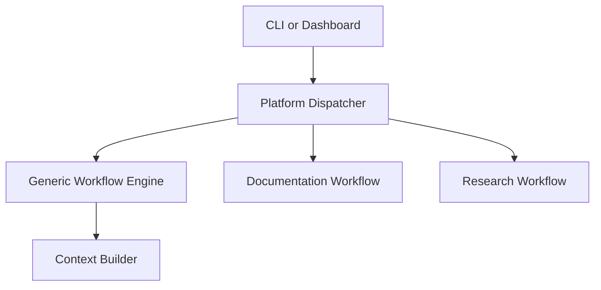

# Component Communication Design

**Version:** 1.1  
**Owner:** Project0  
**Last Updated:** 2026-09-19  
**Source Baseline:** `main` at `eedad41a4a055ca79cdaf623a598103b5db902df`

## Executive Summary

Project0 components communicate through typed, in-process requests and results.
Workflow and reasoning implementations remain synchronous, while Dashboard
submission routes can delegate long-running calls to the shared background-run
manager and return before those calls finish. `PlatformDispatcher` assembles
shared services and directly invokes the Documentation and Research workflows;
the generic `WorkflowEngine` orchestrates only generic task sequences and the
context startup path. Human review and deterministic safeguards remain between
model-generated documentation proposals and repository writes.

## Purpose and Scope

This document defines runtime composition, call paths, lifecycle events, error
propagation, state ownership, and controlled-update boundaries. Agent-specific
algorithms remain in agent documentation. [Shared Data Models and Error
Contracts](Shared_Data_Models_and_Error_Contracts.md) owns detailed object
definitions.

The design uses direct calls plus process-local background execution, typed protocols, frozen
dataclass results where defined, repository-relative paths, deterministic
services when reasoning is unnecessary, explicit review before writes, and
dependency injection. Frozen records provide shallow rather than deep
immutability.

## Component Design

### Runtime composition and dispatch

`python -m project0.main` configures logging, creates a dispatcher, runs one
startup documentation-context workflow through the generic engine, and reports
its result. `python -m project0.dashboard.dashboard_app` creates the configured
FastAPI application, reasoning providers, separate agent dispatchers and UI
services, agent routes, and shared/agent static assets.

The dispatcher exposes context, Documentation, Research, review-submission, and
Documentation-state operations. It validates startup; creates repository,
context, generic workflow, and skill services; and conditionally assembles
agent workflows when dependencies exist.

### Generic engine and shared services

`WorkflowEngine` validates a non-empty name/task list, executes tasks in order,
records timestamps, stops after the first failure, and returns typed task and
workflow results. Injected publishers receive `WorkflowStarted`,
`WorkflowCompleted`, `WorkflowFailed`, `TaskStarted`, `TaskCompleted`, and
`TaskFailed`; events are neither persisted nor controlling. Validation,
artifact, approval, and audit events are absent.

Repository Service performs deterministic discovery and UTF-8 reads for
supported extensions, contains repository-relative paths, returns structured
read/list errors, preserves partial batch success, and excludes generated/cache
directories. Context Builder applies a workflow rule, filters metadata, reads
selected documents, and returns a `ContextPackage`. Discovery failure fails the
package; partial read failures warn; an empty selection completes with warnings.

Knowledge Service separately scans `docs/**/*.md`, builds an in-memory index,
selects and formats up to five documents by default, and serves ordinary
Documentation requests. Explicit paths suppress broad query matching. The
default Documentation Workflow disables baseline documents. Source-grounded
requests bypass broad selection and read only requested targets and sources.

### Reasoning, validation, artifacts, and skills

Reasoning Service converts a `ReasoningRequest` through `PromptBuilder` into a
provider request, calls Ollama or a stub, validates structured output, and
returns a `ReasoningResult`. Supported provider/parsing/validation failures
become failed results. Active skills are appended to system instructions and
recorded in metadata.

Validation Service executes every configured validator and converts unexpected
validator exceptions into failed results without stopping later validators.
Any failure produces aggregate `failed`; otherwise warnings produce
`passed_with_warnings`; otherwise `passed`. The default Documentation Workflow
uses Markdown, Link, and MkDocs validators, not the implemented Documentation
Consistency validator. Research uses its own structured-output and grounding
checks.

Markdown location services identify bounded sections. Documentation Workflow
owns proposal validation and in-memory review. Only approved, matching proposals
reach Repository Update Service, which enforces repository containment,
existing Markdown targets, stale-content checks, bounded edits, and atomic
replacement. It does not commit, push, publish, or deploy. Final validation and
path-scoped Git differences follow approved writes.

Skill Registry discovers and validates immediate `skills/<name>/SKILL.md`
definitions, loads selected instructions, and never executes or selects them.
Only source-grounded Documentation proposal generation currently loads
`strict-documentation-editor`; Research receives no registry.

## Interactions and Contracts

Documentation Workflow coordinates context, reasoning, placement, validation,
review, updates, and Git differences, retaining review state in memory. Gap
analysis precedes source-grounded proposals. Stage 2 sends the provider a
compact rewrite context containing the request, exact target claim, verified
gap, and source evidence, while retaining the complete repository context for
deterministic validation. When Stage 1 identifies exactly one claim for the
proposal path, the workflow assigns that verified claim as the anchor instead
of relying on provider location output. Deterministic checks retain authority.
Revise returns inputs for resubmission; Reject and Skip do not write; Approve
may proceed through application and final validation.

Research Workflow directly coordinates strategy, queries, providers,
metadata/evidence, evaluation, optional context analysis, paper analysis,
direction analysis, and artifacts. It returns state and statistics through
`ResearchResult`; Direction Analysis failure is isolated as a warning.

Dashboard registers agent routers before the generic fallback. Shared routes
are `/`, `/documentation`, `/agents/{agent_identifier}`, `/api/status`,
`/api/system-status`, and `/api/docs`. System status reports configured
provider/model and instantaneous GPU data, not workflow telemetry or durable
state.

`BackgroundRunManager` accepts an agent identifier and callable, assigns a UUID,
and records queued, running, completed, or failed state with timestamps. Agent
routes retain ownership of run/status URLs and presentation. Research augments
run lifecycle with its existing backend workflow-stage snapshot. Documentation
polls platform run lifecycle and reloads its run URL for review or completion.

Typed protocol families cover repository, generic workflow/events, context,
knowledge, reasoning/provider, validation, artifacts, skills, Documentation,
review/update/diff, and Research boundaries. Project0 does not route every call
through the generic engine or normalize all results into one envelope.

## Configuration and Failure Behavior

Dashboard composition recognizes `ollama` and `stub`, with agent-specific model
selection. Logging uses `PROJECT0_LOG_LEVEL`; no persistent audit log exists.

Errors are boundary-specific: invalid workflow/dispatcher requests can raise
`ValueError`; missing optional workflows and Git failures raise `RuntimeError`;
task exceptions become failed task/workflow results; repository failures usually
become `RepositoryError`; context and validation services aggregate supported
errors; Reasoning Service converts supported provider/parsing failures; and
workflow services may return their own failed states. Callers must honor each
boundary instead of assuming exception-only or result-only behavior.

## Constraints and Verification

All current workflows and reasoning calls are synchronous and in process. The
Dashboard runs selected calls in a local thread-pool executor, but there is no
message queue, external worker, distributed transport, or durable workflow/run/
review store. State is retained in background-run records, returned results, or
the Documentation Workflow instance and is lost on restart. Run records do not
expire automatically and are not shared across server processes. Each agent
router defaults to one background worker; Research stage telemetry remains a
single global snapshot.

Focused unit and integration sources cover dispatch, workflows, repository,
context/knowledge, reasoning, validation, locations, updates, Git differences,
skills, Dashboard composition/routes, and assembled agent paths. Browser and
live-provider checks require separate environments. This record describes
source and test inventory at the baseline; it does not claim execution.
