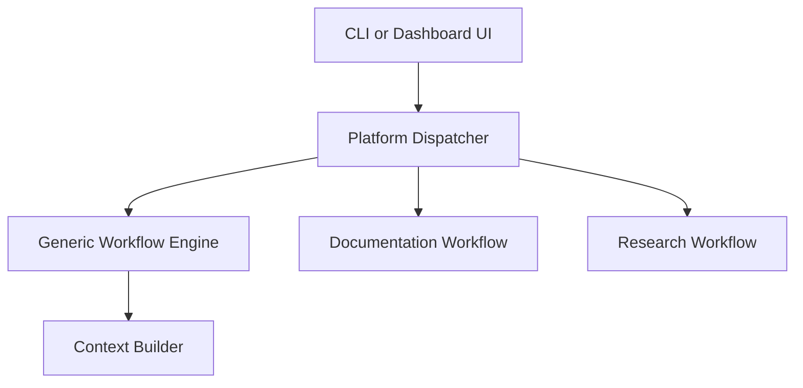

# Component Communication Design

**Version:** 0.8  
**Owner:** Project0  
**Last Updated:** 2026-09-11  
**Source Baseline:** `main` at `da217ae42f7ceeffc95a84c6baad3dc4376a18f9`

## 1. Purpose

This document describes how implemented Project0 platform components communicate: runtime composition, call paths, typed interfaces and models, lifecycle events, error propagation, state ownership, and repository-update boundaries.

Agent-specific algorithms remain in the Documentation Agent and Research Agent documentation sets. The companion **Shared Data Models and Error Contracts** document defines the communication objects in greater detail; this document defines how those objects move between components.

## 2. Scope and Design Principles

The current communication foundation covers:

- application and Dashboard entry paths;
- `PlatformDispatcher`;
- the generic `WorkflowEngine`;
- repository, context, and knowledge services;
- reasoning providers and `ReasoningService`;
- validation services;
- artifact location, review, repository update, and Git diff services;
- the repository-local `SkillRegistry`;
- Documentation and Research workflows; and
- Dashboard and agent UI service boundaries.

The design favors:

- synchronous, in-process request/response calls;
- typed interfaces at component boundaries;
- frozen dataclass result objects where defined;
- repository-relative paths and containment checks;
- deterministic services where model reasoning is unnecessary;
- explicit human review before documentation changes are applied; and
- dependency injection for provider, validator, workflow, and event-publisher implementations.

Frozen dataclasses prevent field reassignment but do not make contained dictionaries or other mutable values deeply immutable.

## 3. Runtime Composition

Project0 has two application entry paths.

### Command-line startup

`python -m project0.main`:

1. configures logging;
2. creates a `PlatformDispatcher`;
3. asks the dispatcher to run one startup documentation-context workflow; and
4. reports success or failure from the resulting `WorkflowExecutionResult`.

This startup path uses the generic `WorkflowEngine`. It does not invoke the Documentation or Research workflow.

### Dashboard startup

`python -m project0.dashboard.dashboard_app` starts the configured FastAPI application. Dashboard composition:

1. configures the selected reasoning provider;
2. creates separate dispatcher instances for the Documentation and Research agent UI services so each receives its configured model name;
3. creates the agent UI services;
4. registers agent-specific routers before the platform fallback router; and
5. mounts shared and agent-specific static assets when their directories exist.

All current workflow and reasoning calls are synchronous and in process. FastAPI route functions may be declared with `async`, but the platform has no message queue, background worker, distributed transport, or durable workflow store.

## 4. Top-Level Dispatch

The important boundary is that the generic `WorkflowEngine` does **not** orchestrate the Documentation or Research workflows. It currently orchestrates generic task sequences and the startup/context path only. The dispatcher calls each agent workflow directly.

`PlatformDispatcher` exposes these operations:

| Operation | Implemented execution path |
| --- | --- |
| `run_context_workflow(...)` | Wraps a Context Builder call in one `WorkflowTask`, then calls `WorkflowEngine.execute(...)`. |
| `run_documentation_workflow(...)` | Builds a `DocumentationWorkflowRequest` and calls the configured Documentation Workflow directly. |
| `run_research_workflow(...)` | Builds a `ResearchRequest` and calls the configured Research Workflow directly, optionally with uploaded context. |
| `submit_documentation_review(...)` | Passes the review to the configured Documentation Workflow directly. |
| `get_workflow_state(...)` | Returns in-memory Documentation Workflow state. |
| `get_documentation_workflow_state(...)` | Backward-compatible alias for `get_workflow_state(...)`. |

Dispatcher construction validates startup, creates the read-only Repository Service, Context Builder, generic Workflow Engine, and repository-local Skill Registry, and conditionally assembles the Documentation and Research workflows when their reasoning dependencies are supplied.

## 5. Generic Workflow Engine

`WorkflowEngine.execute(...)`:

- requires a non-empty workflow name and at least one task;
- accepts or generates a workflow identifier;
- executes `WorkflowTask` actions sequentially in supplied order;
- records timezone-aware start and completion times;
- converts a task exception into a failed `TaskExecutionResult`;
- stops after the first failed task;
- returns an immutable `WorkflowExecutionResult`; and
- publishes lifecycle events only when an event publisher is injected.

Implemented event names are:

| Scope | Events |
| --- | --- |
| Workflow | `WorkflowStarted`, `WorkflowCompleted`, `WorkflowFailed` |
| Task | `TaskStarted`, `TaskCompleted`, `TaskFailed` |

The event publisher contract receives an event name, workflow identifier, and optional task identifier. Without an injected publisher, `_publish(...)` is a no-op. The events are notifications only; they are not persisted and do not control execution.

Validation, artifact, approval, and audit lifecycle events are not implemented.

## 6. Repository and Context Communication

### Repository Service

`RepositoryService` provides deterministic, read-only repository discovery and UTF-8 reads. Its default supported extensions are `.md`, `.yml`, `.yaml`, `.toml`, `.py`, and `.json`.

Callers provide repository-relative paths. The service resolves and validates those paths and prevents traversal outside the configured repository root. It returns typed list, single-read, and batch-read results with structured repository errors for invalid requests, missing files, unsupported types, path escapes, and read failures. Batch reads preserve successful partial results and collect errors.

Discovery excludes configured generated, cache, environment, and dependency directories; returns files in deterministic case-insensitive relative-path order; and supports Markdown-only discovery through `list_documentation_files()`.

### Context Builder path

The Context Builder:

1. obtains a workflow-specific `ContextRule` from the Context Rule Registry;
2. converts that rule to deterministic Context Filter criteria;
3. discovers repository documentation through the Repository Interface;
4. filters repository metadata without reading content;
5. reads the selected files through the Repository Interface; and
6. returns a `ContextPackage`.

A discovery error fails the package. Partial read errors become warnings while successful documents are preserved. An empty selection completes with warnings.

### Knowledge Service path

`KnowledgeService` is a separate Markdown knowledge path used by ordinary Documentation Workflow requests. For each request it discovers `docs/**/*.md`, parses and indexes the documents in memory, selects at most `maximum_documents` (default five), formats the selected context, and returns a `KnowledgeResult`.

Explicit requested paths suppress broad query matching. Baseline documents are optional and enabled by default at the service contract, although the default Documentation Workflow calls the service with baseline documents disabled.

For source-grounded Documentation Workflow requests, the dispatcher-provided context function bypasses broad knowledge selection and reads only the requested target and authoritative source paths through `RepositoryService`.

## 7. Reasoning Communication

`ReasoningService` is the shared boundary between workflows and a reasoning provider:

1. a caller supplies a `ReasoningRequest`;
2. `PromptBuilder` converts it into a provider-neutral `ProviderRequest` with system instructions, user content, response schema, model name, and metadata;
3. a `ReasoningProviderProtocol` implementation generates a `ProviderResponse`;
4. the service validates and converts structured output; and
5. the service returns a `ReasoningResult`.

Provider, parsing, and structured-output validation errors handled by the service become failed results instead of escaping to the workflow.

Shared provider implementations are:

- `OllamaReasoningProvider`, which performs a synchronous `POST` to `<base-url>/api/chat` using `stream: false`, the requested JSON schema as `format`, and the provider instance's temperature; and
- `StubReasoningProvider`, which records requests and either returns a configured response or raises a configured error.

Dashboard composition accepts `ollama` and `stub` as shared reasoning-provider names. Agent-specific model names are selected when the Dashboard creates its dispatcher instances.

Loaded local skills may be carried on `ReasoningRequest.skills`. `PromptBuilder` appends active skill instructions to the system instructions and records their names in provider-request metadata.

## 8. Validation Communication

`ValidationService` executes every configured validator in order. If a validator raises an exception, the service converts it to a failed `ValidatorResult` and continues executing the remaining validators.

It aggregates validator issues and determines the combined status as follows:

| Condition | Validation status |
| --- | --- |
| Any validator failed | `failed` |
| No failure and at least one warning result | `passed_with_warnings` |
| Otherwise | `passed` |

Reusable validator implementations are Markdown, Link, MkDocs, and Documentation Consistency validators. The default Documentation Workflow created by `PlatformDispatcher` configures Markdown, Link, and MkDocs validators. Documentation Consistency is available and exercised explicitly by its integration tests, but is not in the default workflow tuple.

The Research Workflow does not call this reusable Markdown/Link/MkDocs Validation Service. Research structured-output and grounding checks belong to its analysis and evaluation services.

## 9. Artifact Location and Controlled Modification

### Artifact discovery

`MarkdownLocator` produces section locations from Markdown headings, including line bounds and a content hash.

`ArtifactLocationService.discover_locations(...)` supports Markdown artifacts and returns a location only when exactly one heading locator is explicitly mentioned in the request. Ambiguous or unmatched requests return no location. Its standalone `validate_location(...)` checks file existence and, when a start line is present, verifies only that the line remains within the file. Stronger stale-content protection occurs later.

### Review and update boundary

The Documentation Workflow owns proposal validation and in-memory review state. `ReviewCoordinator` obtains and records one of the supported decisions: Approve, Revise, Reject, or Skip.

Only an approved proposal with a matching review identifier can be applied by `RepositoryUpdateService`. The update service:

- resolves the target beneath the repository root;
- limits modifications to an existing `.md` file;
- rejects stale proposals when current content differs from `original_content`;
- applies an artifact-location or exact-anchor edit; and
- writes through a temporary file followed by replacement.

Non-approved proposals are skipped. Application failures are returned as `AppliedDocumentationChange` values. The service does not commit, push, publish, or deploy changes.

After approved updates, the Documentation Workflow performs final validation. `GitDiffService` then runs `git diff --no-ext-diff --` for validated repository-relative paths. It does not modify Git state and raises `RuntimeError` if Git returns a nonzero status.

## 10. Skill Communication

`SkillRegistry` discovers repository-local definitions at `skills/<name>/SKILL.md` in deterministic directory-name order. Discovery validates each definition and returns metadata without instruction bodies. Invalid discovered definitions raise errors rather than being silently skipped.

Loading validates the requested kebab-case name, path containment, YAML frontmatter, required fields, and directory/name agreement, then returns the full skill definition. The registry does not execute instructions or select skills.

The dispatcher exposes the shared registry and supplies it to the Documentation Workflow. Source-grounded documentation proposal generation explicitly loads `strict-documentation-editor`; ordinary documentation requests do not. The Research Workflow does not currently receive the registry.

## 11. Agent Workflow Boundaries

### Documentation Workflow

At the platform communication level, the Documentation Workflow coordinates context acquisition, reasoning, artifact location, validation, review, repository update, and Git diff generation. It preserves its own workflow state in memory and returns typed state or result objects.

Source-grounded requests use a comparison-only gap-analysis reasoning call before proposal generation. The strict skill is applied to proposal generation, while deterministic workflow checks retain authority over source fidelity, target paths, proposal form, artifact placement, validation, and review.

Revision returns a proposal to reasoning. Rejection and Skip do not modify the repository. Approval may proceed to controlled application, final validation, and diff generation.

### Research Workflow

At the platform communication level, the Research Workflow directly coordinates its strategy, query, source retrieval, metadata/evidence acquisition, evaluation, optional context ingestion and analysis, per-paper analysis, direction analysis, and artifact services. It preserves workflow state and evidence/source statistics in the returned `ResearchResult` rather than in the generic Workflow Engine.

Research Direction Analysis failure is isolated as a completed-result warning. Detailed retrieval, evaluation, grounding, and artifact rules remain in the Research Agent documentation.

## 12. Dashboard Communication

The FastAPI application owns the shared shell, platform routes, system-status APIs, templates, and static assets. Documentation and Research routers are registered before the generic agent fallback, so implemented agent routes take precedence.

Implemented platform routes are:

| Route | Behavior |
| --- | --- |
| `GET /` | Renders the Dashboard home page. |
| `GET /documentation` | Returns a 307 redirect to `http://127.0.0.1:8000`. |
| `GET /agents/{agent_identifier}` | Renders the fallback page when no earlier agent-specific route matches. |
| `GET /api/status` | Returns basic application availability and project-root information. |
| `GET /api/system-status` | Returns configured provider/model and current NVIDIA GPU name, utilization, and VRAM information. |
| `GET /api/docs` | Serves FastAPI's generated API documentation. |

The system-status endpoint accepts an optional agent selector for model reporting. It does not expose live workflow-stage telemetry or durable state.

## 13. Interfaces and Communication Models

Project0 uses structural `Protocol` interfaces so implementations can be substituted without explicit inheritance. Implemented interface families include repository, workflow/event publisher, context builder, knowledge, reasoning/provider, validation/validator, artifact location, Documentation Workflow, review, repository update, Git diff, and Research Workflow/service contracts.

Major communication-model families include:

| Family | Representative objects |
| --- | --- |
| Context | `ContextWorkflowType`, `ContextBuildStatus`, `ContextRequest`, `ContextDocument`, `ContextPackage` |
| Generic workflow | `WorkflowStatus`, `TaskStatus`, `WorkflowTask`, `TaskExecutionResult`, `WorkflowExecutionResult` |
| Repository | `RepositoryQuery`, `RepositoryFile`, `RepositoryError`, `RepositoryListResult`, `FileReadResult`, `FileBatchResult` |
| Knowledge | `KnowledgeRequest`, `KnowledgeResult` and document/index selection models |
| Reasoning | `ReasoningRequest`, `ProviderRequest`, `ProviderResponse`, `ReasoningResult` and proposed-change/gap models |
| Validation | `ValidationRequest`, `ValidationResult`, `ValidatorResult`, `ValidationIssue`, status and severity enums |
| Artifacts | `ArtifactLocation` and artifact location types |
| Skills | `SkillMetadata`, `SkillDefinition` |
| Documentation | Requests, states, results, reviews, change proposals, applied changes, statuses and summaries |
| Research | Requests, strategy/query/source/evidence/evaluation/analysis/artifact results, statistics, warnings and statuses |

The companion **Shared Data Models and Error Contracts** document is authoritative for model fields and detailed contracts.

## 14. Error Handling

Project0 intentionally uses both exceptions and typed error results according to the boundary:

- invalid generic workflow requests raise `ValueError`;
- task exceptions become failed task and workflow results;
- repository failures are normally represented by structured `RepositoryError` values;
- repository discovery failure produces a failed `ContextPackage`;
- partial repository reads produce warnings while preserving successful context;
- validation exceptions become failed validator results;
- reasoning provider, parsing, and output-validation failures handled by `ReasoningService` become failed reasoning results;
- missing optional dispatcher workflows raise `RuntimeError` when invoked;
- invalid dispatcher input raises `ValueError`;
- Git command failure raises `RuntimeError`; and
- workflow-specific services may convert local failures into their own typed state or result contracts.

Callers must therefore honor the contract of the invoked boundary rather than assuming either exception-only or result-only error handling.

## 15. State, Logging, and Traceability

`configure_logging()` installs console logging at the level selected by `PROJECT0_LOG_LEVEL` and reduces verbose `httpx` and `httpcore` output. There is no persistent audit log.

Traceability is carried by the identifiers, names, statuses, timestamps, warnings, and errors present in the relevant models and log records. Depending on the path, this includes workflow, task, context, validation, proposal, review, and application identifiers.

State remains process-local:

- generic workflow state exists in returned results;
- Documentation Workflow review state is stored in memory by its workflow instance;
- Research state is returned in `ResearchResult`; and
- restarting the process loses in-memory workflow state.

## 16. Verification Evidence

The repository contains focused unit coverage for the dispatcher, generic Workflow Engine, repository services, Context Builder, Knowledge Service, reasoning service, validation service, artifact location, repository update, Git diff, Skill Registry, and Dashboard composition/routes. Integration coverage exercises dispatcher, context, knowledge, reasoning, validation, and Dashboard flows. Documentation and Research workflow tests cover their agent-specific orchestration and failure behavior.

This document describes the checked-in implementation and test coverage at the stated source baseline. It does not claim that the test suite was executed as part of this document merge.

## 17. Current Boundaries

The pinned implementation does not provide:

- durable workflow, review, or audit storage;
- asynchronous or distributed workflow execution;
- message queues or background workers;
- validation, artifact, approval, or audit event families;
- automatic Git commit, push, pull request, publication, or deployment;
- a general plugin architecture;
- external skill installation or trust management;
- automatic skill selection across workflows; or
- CI workflows under `.github/workflows/`.

Future expansion may add durable state, richer events, concurrent or distributed execution, broader skill integration, and monitoring. Those capabilities should preserve the current boundaries between dispatch, workflow ownership, deterministic services, reasoning, human approval, and repository mutation.

## 18. Summary

Project0 uses synchronous, typed, in-process communication. The Platform Dispatcher assembles shared services and directly invokes the Documentation and Research workflows, while the generic Workflow Engine currently owns only generic task sequences and the startup/context path. Repository access, validation, artifact location, skill loading, review, controlled Markdown updates, and Git diff generation remain separate services with explicit responsibilities. Workflow state is in memory, lifecycle event publishing is optional, and no persistent or distributed transport is implemented.
