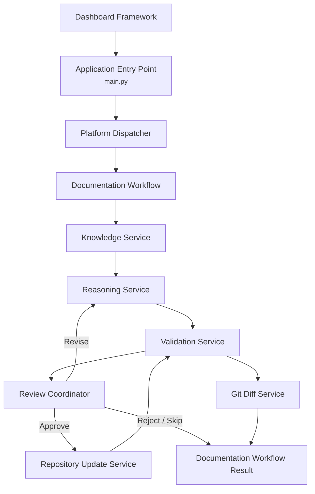

# Component Communication Design

**Version:** 0.5  
**Owner:** Project0  
**Last Updated:** 2026-08-17  

---

## 1. Purpose

This document defines how Project0 platform components communicate. It establishes the implemented communication patterns, execution flow, interface responsibilities, shared model usage, and event handling.

It complements, but does not replace, the **Shared Data Models and Error Contracts** document, which defines the communication objects themselves.

## 2. Scope

This document applies to the following implemented components:

* Platform Dispatcher
* Workflow Engine
* Context Builder
* Context Rule Registry
* Context Filter
* Repository Service
* Shared Interfaces
* Shared Context Models
* Shared Workflow Models

It also includes the following implemented components:

* Reasoning Service
* Validation Service
* Review Coordinator
* Repository Update Service
* Git Diff Service
* Artifact Location Service
* Documentation Workflow

The communication architecture provides the foundation for future AI agents.

## 3. Design Objectives

The communication architecture shall:

* Minimize component coupling.
* Depend on typed interfaces rather than concrete implementations where practical.
* Use shared immutable models for component communication.
* Maximize reuse across future AI agents.
* Provide workflow and task traceability.
* Preserve deterministic behavior where AI reasoning is not required.
* Support human approval before repository changes are applied.
* Allow future distributed and asynchronous execution.

## 4. Communication Principles

1. The Platform Dispatcher provides the platform-level entry point.
2. The Workflow Engine owns workflow task execution.
3. Components communicate through defined typed interfaces.
4. Shared data models are the authoritative communication objects.
5. Components do not directly access another component's internal state.
6. The Context Builder coordinates context selection through the Context Rule Registry, Context Filter, and Repository Interface.
7. Repository discovery operations are read-only.
8. Repository modifications shall occur only through the Repository Update Service after successful validation and explicit user approval.
9. Significant workflow and task state changes may generate events.
10. Components shall not bypass the Workflow Engine for workflow execution control.

## 5. Communication Model

Project0 currently uses two communication patterns.

### Synchronous Request/Response

Used when an immediate result is required.

Implemented examples:

* Dispatch a context workflow.
* Execute a Workflow Task.
* Request workflow-specific Context Filter criteria.
* Discover repository documentation.
* Read repository files.
* Build a Context Package.
* Return a Workflow Execution Result.

### Workflow and Task Events

Used to announce execution lifecycle changes when a Workflow Event Publisher is configured.

Implemented events:

* `WorkflowStarted`
* `WorkflowCompleted`
* `WorkflowFailed`
* `TaskStarted`
* `TaskCompleted`
* `TaskFailed`

Validation processing is implemented through the Validation Service. Documentation review, repository updates, and Git diff generation are implemented through the Documentation Workflow. Validation lifecycle events and audit events remain future enhancements.

## 6. Implemented Communication Flow

The implemented sequence is:

1. `main.py` creates the Platform Dispatcher.
2. The Platform Dispatcher dispatches the Documentation Workflow.
3. The Documentation Workflow requests repository knowledge from the Knowledge Service and coordinates artifact-based documentation modification through the Artifact Location Service.
4. The Knowledge Service returns structured repository context.
5. The Reasoning Service generates proposed documentation changes.
6. The Validation Service validates proposed documentation changes.
7. The Review Coordinator processes each proposal individually.
8. Approved changes are applied by the Repository Update Service.
9. Revised changes return to the Reasoning Service.
10. Rejected and skipped changes continue without repository modification.
11. Approved repository updates undergo final validation.
12. The Git Diff Service generates a repository diff.
13. The Documentation Workflow returns a Documentation Workflow Result.

## 7. Platform Responsibilities

### Platform Dispatcher

* Assemble default platform services.
* Create platform-level Workflow Tasks.
* Dispatch tasks to the Workflow Engine.
* Preserve supplied workflow identifiers or generate new identifiers.
* Return Workflow Execution Results.
* Avoid implementing repository, context, or workflow behavior directly.
* Dispatch Documentation Workflows.
* Return Documentation Workflow Results.
* Provide workflow state access through platform interfaces.

### Workflow Engine

* Validate workflow requests.
* Execute tasks in supplied order.
* Track workflow and task identifiers.
* Capture task outputs and failures.
* Stop execution after the first failed task.
* Publish configured workflow and task events.
* Return structured Task and Workflow Execution Results.

### Context Builder

* Request workflow-specific selection criteria.
* Apply deterministic Context Filters.
* Read selected documents through the Repository Interface.
* Preserve repository document metadata.
* Return Context Packages.
* Preserve partial results and communicate read warnings.

### Context Rule Registry

* Resolve Context Rules by workflow type.
* Convert Context Rules into Context Filter criteria.
* Maintain default workflow-specific selection policies.
* Report requests for unregistered workflow types.

### Context Filter

* Apply documentation, extension, path, and pattern criteria.
* Normalize repository paths.
* Return selected files in deterministic order.
* Avoid reading repository content or defining workflow policy.

### Repository Service

* Discover supported repository files.
* Discover Markdown documentation.
* Read one or multiple repository files.
* Validate repository-relative paths.
* Prevent access outside the repository root.
* Return structured repository results and errors.

## Validation Service

* Coordinate configured validators.
* Execute validators through the Validation Interface.
* Aggregate Validator Results.
* Return immutable Validation Results.
* Isolate validator execution failures.
* Support dependency injection for validator implementations.

## Review Coordinator

* Coordinate user review.
* Process Approve, Revise, Reject, and Skip decisions.
* Produce immutable review results.

## Repository Update Service

* Apply approved documentation changes using validated artifact locations.
* Preserve repository integrity.
* Produce immutable application results.

## Git Diff Service

* Generate Git diffs for approved repository updates.
* Restrict diffs to modified files.
* Report Git execution failures.

## Documentation Workflow

* Coordinate Knowledge, Reasoning, Validation, Review, Repository Update, Artifact Location, and Git Diff services.
* Preserve internal workflow state.
* Return immutable Documentation Workflow Results.

### Shared Interfaces

* Define stable component contracts.
* Include Repository, Workflow, Context Builder, Knowledge, Validation, Validator, Documentation Workflow, Review Coordinator, Repository Update, and Git Diff interfaces.
* Allow structural conformance without explicit inheritance.
* Support dependency injection and isolated testing.
* Allow alternate implementations without changing consumers.

### Shared Data Models

* Define immutable communication objects.
* Provide shared workflow and task statuses.
* Provide Context Packages, Knowledge Results, Validation Results, Validator Results, Workflow Execution Results, Documentation Workflow Results, Documentation Reviews, Documentation Change Proposals, and Applied Documentation Changes.
* Preserve identifiers, timestamps, outputs, warnings, and errors.

### Planned Components

The following responsibilities remain planned:

* Dashboard and audit storage
* Persistent workflow history
* Distributed communication
* Additional AI agents

## 8. Communication Contracts

Implemented communication objects include:

### Context Models

* `ContextWorkflowType`
* `ContextBuildStatus`
* `ContextRequest`
* `ContextDocument`
* `ContextPackage`

### Workflow Models

* `WorkflowStatus`
* `TaskStatus`
* `WorkflowTask`
* `TaskExecutionResult`
* `WorkflowExecutionResult`

### Repository Results

* Repository file metadata
* Repository list results
* Individual file read results
* Batch file results
* Structured repository errors

Implemented validation communication objects include Validation Requests, Validation Results, Validator Results, Validation Issues, Validation Status, and Validation Severity. Additional approval and agent communication objects remain planned in **Shared_Data_Models_and_Error_Contracts.md**. Artifact communication objects are implemented through the artifact foundation.

## 9. Event Categories

### Implemented Workflow Events

* `WorkflowStarted`
* `WorkflowCompleted`
* `WorkflowFailed`

### Implemented Task Events

* `TaskStarted`
* `TaskCompleted`
* `TaskFailed`

### Future Validation Events

* `ValidationStarted`
* `ValidationCompleted`
* `ValidationFailed`

### Planned Artifact Events

* `ArtifactProposed`
* `ArtifactValidated`
* `ArtifactApproved`
* `ArtifactCommitted`

### Planned Approval Events

* `ApprovalRequested`
* `ApprovalGranted`
* `ApprovalRejected`

## 10. Error Handling

Current errors are communicated through exceptions or structured result objects, depending on the component boundary.

Implemented behavior includes:

* Invalid workflow requests raise `ValueError`.
* Task exceptions are converted into failed Task Execution Results.
* A failed task produces a failed Workflow Execution Result.
* Repository errors include an error code, message, and optional path.
* Repository discovery failure produces a failed Context Package.
* Partial repository reads produce a Context Package with warnings.
* Empty context selection produces a completed-with-warnings Context Package.

Future shared error contracts may additionally identify:

* originating component
* workflow identifier
* task identifier
* severity
* recovery recommendation

## 11. Logging and Traceability

Implemented communication is traceable through:

* workflow identifier
* task identifier
* context identifier
* workflow and task names
* timezone-aware timestamps
* component logger name
* workflow status
* task status
* context source count
* structured warnings and errors

Persistent audit storage is not part of the current implementation.

## 12. Initial Implementation

The implemented Phase 7 communication foundation uses:

* Python structural `Protocol` interfaces
* Python immutable dataclasses
* String enumerations for statuses and workflow types
* Synchronous in-process communication
* Optional workflow event publishing
* Structured application logging
* Repository-relative file access
* pytest unit and integration testing
* End-to-end Documentation Workflow orchestration
* Repository update coordination
* Git diff generation

The current implementation does not yet use:

* Pydantic
* persistent message queues
* SQLite audit storage
* distributed communication
* asynchronous workflow execution

## 13. Future Evolution

The communication architecture is designed to support future enhancements including:

* Additional validation services
* Persistent workflow state
* Persistent audit storage
* Distributed agents
* Persistent message queues
* Cloud execution
* Multiple concurrent workflows
* Additional AI agent types
* Enhanced dashboard monitoring
* Asynchronous workflow execution

## 14. Relationship to Shared Data Models and Error Contracts

This document defines **how** Project0 platform components communicate.

The companion document **Shared_Data_Models_and_Error_Contracts.md** defines **what** is communicated.

The two documents are intended to be used together:

  -----------------------------------------------------------------------
  Document              Responsibility
  --------------------- -------------------------------------------------
  Shared Data Models    Defines shared model structures, identifiers,
  and Error Contracts   statuses, results, and error contracts.

  Component             Defines communication patterns, execution flow,
  Communication Design  events, and component responsibilities.
  -----------------------------------------------------------------------

Communication payloads shall conform to the shared models defined in the
companion document or to implemented subsystem result contracts.

## 15. Implementation Status

The Phase 7 communication architecture has been implemented and
validated through comprehensive unit and integration testing.

The validated end-to-end communication flow includes:

1. Platform Dispatcher
2. Workflow Engine
3. Knowledge Service
4. Reasoning Service
5. Validation Service
6. Review Coordinator
7. Repository Update Service
8. Git Diff Service
9. Documentation Workflow
10. Documentation Workflow Results

The implemented Validation Service coordinates:

* Markdown Validator
* Link Validator
* MkDocs Validator
* Documentation Consistency Validator

The next implementation phase will extend this communication foundation with semantic retrieval, embedding generation, vector search, and additional AI agent capabilities.

