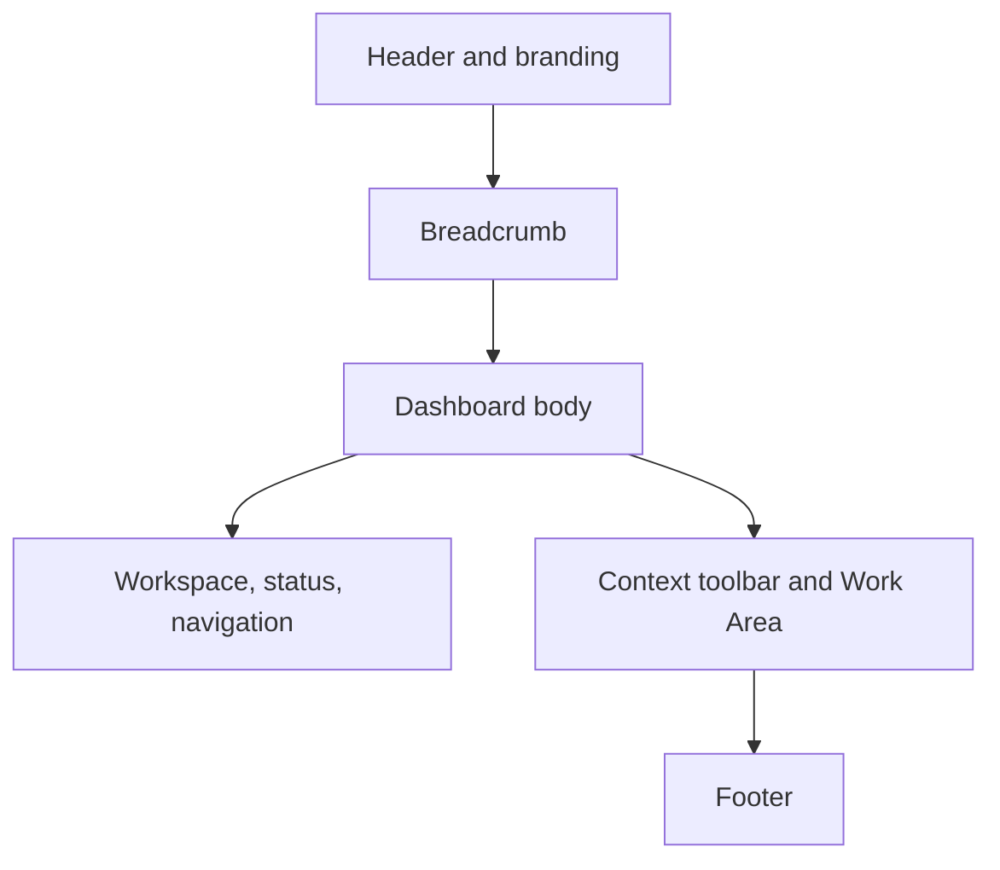

# Dashboard Design

**Version:** 0.9  
**Owner:** Project0  
**Last Updated:** 2026-09-11  
**Source Baseline:** `main` at `da217ae42f7ceeffc95a84c6baad3dc4376a18f9`

## 1. Purpose

The Project0 Dashboard is the local browser interface for shared platform pages and registered AI agents. This document defines the implemented Dashboard architecture, shared shell, navigation, routing, status presentation, application composition, agent-extension boundary, and current limitations.

Agent-specific forms, workflow actions, results, and review behavior belong in the applicable Agent Interface Design documents.

## 2. Design Principles

The Dashboard follows these implemented or governing principles:

- browser-based, local-first operation;
- one shared Project0 application shell rather than independent agent applications;
- consistent navigation and presentation across agents;
- human-in-the-loop interaction for workflows that modify repository content;
- reuse of platform workflows through `PlatformDispatcher`;
- separation of templates and route handling from workflow business logic;
- platform ownership of shared layout, navigation, status presentation, and extension points; and
- agent ownership of agent-specific pages, controls, view models, results, and CSS.

The current application is synchronous and process-local. It is designed as a development interface, not as an authenticated, multi-user, remotely deployed service.

## 3. Technology and Startup

The Dashboard uses:

- FastAPI for application and route composition;
- Jinja2 for server-rendered HTML;
- shared and agent-specific CSS;
- browser-side JavaScript for interaction and status polling; and
- Uvicorn for local ASGI hosting.

Run the configured Dashboard with:

```bash
python -m project0.dashboard.dashboard_app
```

The module's `main()` starts a reload-enabled Uvicorn factory on `127.0.0.1:8001`. The configured factory is `create_project0_dashboard_app()`.

The module also exports `app = create_dashboard_app()`. That module-level application is intentionally a bare shared Dashboard and does not contain Documentation or Research agent UI services unless a caller supplies them. The executable `main()` uses the configured factory, not the bare module-level application.

Project0 documentation is served separately. The Dashboard's Documentation link assumes a local MkDocs server at `http://127.0.0.1:8000`.

## 4. Application Composition

### Configured factory

`create_project0_dashboard_app()`:

1. configures logging;
2. selects the configured reasoning-provider implementation;
3. creates separate `PlatformDispatcher` instances for the Documentation and Research UI services so each dispatcher receives its agent-specific model name;
4. constructs `DocumentationAgentUIService` and `ResearchAgentUIService`; and
5. passes both services to `create_dashboard_app()`.

For the `stub` provider, configured deterministic Documentation and Research provider implementations are used. For `ollama`, a shared `OllamaReasoningProvider` instance is supplied to the two dispatcher constructions with different model-name settings.

### Shared application factory

`create_dashboard_app()`:

- resolves the supplied project root or defaults to the current working directory;
- creates the FastAPI application with `/api/docs` as its documentation endpoint and no ReDoc endpoint;
- stores the resolved project and Dashboard roots in application state;
- registers an agent router only when the corresponding UI service is supplied;
- stores supplied agent services and agent roots in application state;
- mounts an agent's CSS only when that agent is supplied and its CSS directory exists;
- registers the shared Dashboard router after agent routers; and
- mounts shared CSS at `/css` when the directory exists.

Each factory call creates an independent FastAPI instance.

### Route precedence

Agent-specific routers are registered before the generic `/agents/{agent_identifier}` route. FastAPI therefore matches a registered agent's exact routes first, while the shared route remains a fallback for unknown or unconfigured identifiers.

## 5. Shared Application Shell

`dashboard/templates/dashboard.html` owns the persistent shell:



The template provides overridable blocks for:

- page title;
- page-specific styles;
- header actions;
- breadcrumb content;
- agent and Workspace navigation;
- context-toolbar container and actions;
- Work Area content;
- footer details; and
- scripts.

Only the active page's Work Area, toolbar, breadcrumb, styles, and scripts vary through template inheritance. The shared Header, Sidebar, System Status panel, Navigation panel, and Footer remain part of the application shell.

### Header and breadcrumb

The Header displays Project0 branding and the subtitle “AI-Native Software Development Platform.” It provides an empty extension block for page-specific header actions. Authentication controls, user information, Help, and Logout are not implemented.

The breadcrumb region is always present and exposes a template block. The Project Overview renders a single “Project Overview” item; agent templates supply their own breadcrumb content.

### Sidebar

The Sidebar contains three persistent sections:

1. **Workspace** — Project Overview followed by the agents listed in `DASHBOARD_AGENTS`;
2. **System Status** — active agent, state, optional operation and elapsed time, LLM provider/model, and GPU information; and
3. **Navigation** — Documentation, Activity, and Settings links.

Contrary to the older design description, System Status is not confined to the Project Overview Work Area. It is rendered persistently in the Sidebar, including on agent pages.

### Context toolbar and Work Area

The shared template provides a context-toolbar region above the Work Area. Pages own the actions within that region and may suppress the entire container. The Project Overview currently suppresses it.

The Work Area contains the active platform or agent page. Agent-specific workflow controls must remain in the agent template rather than being added to the shared shell solely for one agent.

## 6. Navigation and Registration

`DASHBOARD_AGENTS` currently advertises:

| Identifier | Display name | Availability |
| --- | --- | --- |
| `documentation` | Documentation Agent | Available |
| `research` | Research Agent | Available |

The configured factory supplies both UI services, so both agents have exact registered routes. The shared factory can also be created without either service; in that case the links remain advertised, but the generic agent fallback handles them.

The Workspace section identifies the active link with `aria-current="page"`. Agent activity may be derived from either `active_page` or an agent-provided `active_navigation` value.

The Navigation section displays links for Documentation, Activity, and Settings. Only Documentation has a shared route. `/activity` and `/settings` are visible navigation targets but are not implemented in the pinned source and therefore return the normal not-found response.

There is no dynamic agent registry. Adding an agent currently requires Python application composition, routes, templates, and related assets rather than configuration-only registration.

## 7. Platform Routes

| Method and path | Implemented behavior |
| --- | --- |
| `GET /` | Renders the Project Overview using `dashboard_home.html`. |
| `GET /documentation` | Returns a 307 redirect to `http://127.0.0.1:8000`. |
| `GET /agents/{agent_identifier}` | Renders the generic placeholder when no earlier exact agent route matches. |
| `GET /api/status` | Returns the application name, `available` status, and resolved project root. |
| `GET /api/system-status` | Returns configured provider/model and current NVIDIA GPU values. |
| `GET /api/docs` | Serves FastAPI's generated API documentation. |

The generic agent route strips whitespace, converts the identifier to lowercase, and uses known names for Documentation and Research. Other identifiers are converted from kebab case to a title-cased display name.

Unknown non-agent routes return FastAPI's standard 404 response.

## 8. Project Overview

`GET /` renders two cards in the Work Area.

### Project Summary

The Project Summary displays:

- project name;
- resolved repository root;
- current phase;
- repository name;
- current Git branch;
- count of `.md` files beneath `docs/`; and
- platform version.

### Platform Health

The Platform Health card displays:

- most recently recorded test status;
- most recently recorded validation status;
- Git working-tree status; and
- configured LLM provider.

### Data sources and failure behavior

| Value | Source and fallback |
| --- | --- |
| Repository root | Resolved application input or current working directory. |
| Repository name | Hard-coded as `project0`. |
| Git branch | `git branch --show-current`; `Unknown` on failure or empty output. |
| Git status | `git status --porcelain`; `Clean`, `Modified`, or `Unavailable`. |
| Current phase | Hard-coded as `Phase 11 – Research Agent Functional Validation`. |
| Documentation count | Recursive `.md` count beneath `docs/`; `Unknown` when that directory is absent. |
| Platform version | Hard-coded as `0.1.0`. |
| Test and validation text | Parsed from `docs/platform/Project0_Test_Results.md`. |
| LLM provider | `PROJECT0_REASONING_PROVIDER`, defaulting to `ollama`. |

Test parsing recognizes lines beginning exactly with `**Tests:** ` and `**Validation:** `. Missing or unreadable content becomes `Not run` and `Unavailable`, respectively.

These fields are display snapshots, not a live health-check framework. The Dashboard does not run tests or validation. Assigned CSS status classes are presentation choices and do not independently verify success.

The hard-coded Phase 11 label is stale relative to the current platform roadmap/status. This is an implementation inconsistency documented here, not a claim that the repository is still in Phase 11.

## 9. System Status

The shared shell initially receives:

- Active Agent: `None` unless an agent page overrides it;
- State: `Idle` unless an agent page overrides it;
- optional Operation and Elapsed rows, hidden when no value is supplied;
- LLM provider and selected model; and
- GPU name, utilization, and VRAM.

`GET /api/system-status` accepts an optional `agent` query parameter. For the `ollama` provider, model resolution is:

| Agent context | Environment precedence | Default |
| --- | --- | --- |
| Research | `PROJECT0_RESEARCH_OLLAMA_MODEL`, then `PROJECT0_OLLAMA_MODEL` | `qwen2.5:7b` |
| Documentation | `PROJECT0_DOCUMENTATION_OLLAMA_MODEL`, then `PROJECT0_OLLAMA_MODEL` | `gemma3:4b` |
| Other or none | `PROJECT0_OLLAMA_MODEL` | `qwen2.5:7b` |

For a non-Ollama provider, the displayed model is `Not applicable`.

GPU values come from the first output row of:

```text
nvidia-smi --query-gpu=name,utilization.gpu,memory.used,memory.total --format=csv,noheader,nounits
```

Command failure, empty output, or malformed output produces `Unavailable` values.

Both implemented agent pages poll `/api/system-status` with their agent identifier every two seconds. Their browser scripts separately update Active Agent, State, Operation, and Elapsed presentation during a request. The endpoint itself reports only configuration and instantaneous GPU data; it does not expose server-side workflow stages, test execution, durable activity, or Ollama process health.

## 10. Documentation Integration

The Dashboard does not replace or start MkDocs. During local development:

- `http://127.0.0.1:8000` is expected to host MkDocs; and
- `http://127.0.0.1:8001` hosts the Dashboard.

The shared Documentation link redirects to the MkDocs origin. A GitHub Pages deployment may host published documentation separately, but the current Dashboard route does not select or manage it.

## 11. Agent Integration Boundary

The shared Dashboard owns:

- the application factory and route-registration order;
- shared shell, branding, breadcrumb region, Sidebar, Navigation, System Status, toolbar region, Work Area, and Footer;
- platform page routes and templates;
- shared style tokens and components; and
- UI-service extension points for registered agents.

Each agent owns:

- its exact routes;
- request and review forms;
- workflow invocation through its UI service;
- agent-specific view models;
- result, warning, validation, analysis, or diff presentation;
- agent-specific toolbar actions;
- browser interaction scripts; and
- agent-specific templates and CSS.

The Documentation Agent currently provides request and review routes. The Research Agent provides request and result routes. Their complete interaction flows remain in their respective interface documents.

The Dashboard UI services call `PlatformDispatcher`; the shared Dashboard does not reproduce workflow business logic. Workflow execution remains synchronous, so browser-side processing feedback is not evidence of a separate asynchronous server job.

## 12. Visual and Responsive Standards

The shared stylesheet defines reusable colors, spacing, typography, status treatments, toolbar controls, cards, forms, messages, and shell dimensions. Agent styles extend the shared base.

Implemented responsive behavior includes:

- below 900 px, the two-column body becomes a single column, the Sidebar moves above the Work Area, and separating borders adjust;
- below 640 px, Header and Footer contents stack, toolbar actions wrap, status rows become single-column, and summary rows stack; and
- grids use responsive column sizing where defined.

Implemented accessibility-related structure includes:

- `<html lang="en">` and UTF-8/viewport metadata;
- semantic Header, Navigation, Aside, Main, Section, Article, and Footer elements;
- an `aria-label` on the breadcrumb, toolbar, and Project Overview grid;
- `aria-current="page"` for active navigation; and
- native form controls in agent templates.

These features improve semantic structure but do not constitute a formal accessibility-compliance claim.

## 13. Shared Page Responsibilities

The template architecture supports four page-level elements:

1. page title;
2. breadcrumb location;
3. optional context toolbar; and
4. Work Area content.

The shared shell supplies the surrounding structure. A page may omit an unused toolbar, as the Project Overview does. This block-based separation lets agent pages reuse the platform experience while retaining ownership of their specific interactions.

## 14. Verification Evidence

Shared Dashboard behavior is covered principally by:

- `tests/unit/dashboard/test_dashboard_app.py` for factory metadata, state, independent instances, conditional router/CSS registration, route precedence, configured provider behavior, and configured application composition;
- `tests/unit/dashboard/test_dashboard_routes.py` for shell context, Project Overview display, status fallbacks, agent placeholders, redirects, status APIs, model selection, GPU fallbacks, and unknown routes; and
- `tests/integration/platform/test_dashboard_flow.py` for home, documentation navigation, agent navigation, status endpoints, OpenAPI, and not-found flows.

Agent browser behavior is covered by agent-specific acceptance suites and requires the additional browser environment described in the Testing Guide.

This document describes checked-in behavior and test coverage at the stated source baseline. It does not claim that the tests were executed as part of this document merge.

## 15. Current Limitations

The shared Dashboard does not currently implement:

- authentication, authorization, logout, or user profiles;
- Help behavior;
- `/activity` or `/settings` pages;
- persistent activity or workflow history;
- asynchronous jobs, background workers, or server-side progress telemetry;
- automatic MkDocs startup or embedded documentation serving;
- remote or cloud deployment configuration;
- dark mode;
- a dynamic plugin or agent-discovery registry; or
- configuration-only agent installation.

Future expansion may include these capabilities, but they should preserve the ownership boundary between the shared Dashboard shell, agent interfaces, and platform workflows.

## 16. Summary

Project0's Dashboard is a local FastAPI/Jinja2 application with a persistent shared shell and separately owned agent interfaces. The executable factory registers Documentation and Research services through separate dispatchers, while the bare factory can create the platform shell alone. Shared status and navigation remain visible in the Sidebar, agent routes take precedence over the generic fallback, and the Project Overview reports repository and configuration snapshots. Current execution is synchronous and in memory; Activity, Settings, authentication, durable history, and server-side progress telemetry are not implemented.
