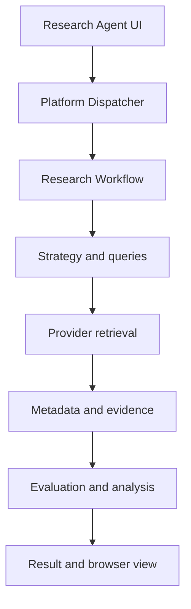
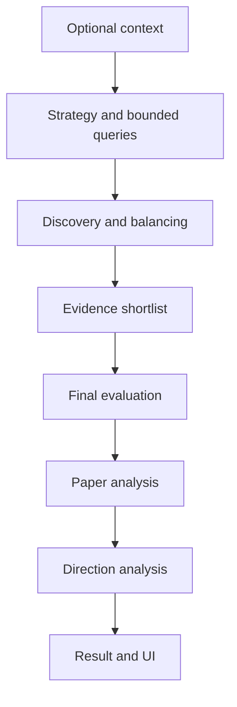

# Research Agent Architecture

**Version:** 0.6  
**Owner:** Project0  
**Last Updated:** 2026-09-11

## 1. Executive Summary

The Project0 Research Agent is a synchronous, local-first workflow hosted in the shared Dashboard and invoked through the Platform Dispatcher. Deterministic services control context ingestion, strategy, bounded query generation, provider dispatch, deduplication, shortlist boundaries, validation, and presentation mapping. Schema-constrained reasoning services perform context interpretation, evidence evaluation, retained-paper analysis, and research-direction synthesis. Generated findings remain distinct from source metadata and evidence, and recoverable defects are reported rather than silently treated as supported conclusions.

## 2. Purpose and Scope

This document defines the implemented component organization, runtime flow, dependencies, responsibility boundaries, and architectural constraints of the Research Agent. Algorithmic rules, exact limits, and data fields belong in the Research Agent Design and Interface Design.

Agent-specific routes, templates, presentation models, and UI adapters remain under `project0.agents.research`. The Dashboard supplies the shared shell, and the Platform Dispatcher provides the composition and invocation boundary. Components exchange typed immutable models through explicit protocols. The Research Agent does not use the Documentation Agent's artifact-validation pipeline.

## 3. Architecture and Components

### Runtime topology

`create_project0_dashboard_app()` creates separate Documentation and Research dispatchers so each agent can use its configured model. In Ollama mode, both may share one `OllamaReasoningProvider`; the Research dispatcher constructs the complete Research Workflow.

The workflow is synchronous. The browser shows a client-side processing state while the POST request runs in a Starlette thread pool; it receives no per-stage server progress events.

### Browser and platform components

- **Research Agent routes** expose `GET /agents/research` and `POST /agents/research/request`, read optional upload bytes, delegate blocking work through `run_in_threadpool`, and render the resulting page state.
- **UI Service and view models** validate the question, invoke the dispatcher, map `ResearchResult` into immutable browser models, consolidate paper data by source identity, merge evaluation warnings into relevance limitations, and derive page status.
- **Platform Dispatcher** constructs `ResearchRequest`, invokes the Research Workflow, and wires the current services, providers, and agent-specific model.

### Context, strategy, and discovery

- **Context Ingestion Service** accepts UTF-8 Markdown/text and text-extractable PDF input using pypdf. It does not perform OCR, chunking, or persistent upload storage.
- **Existing Research Context Analysis Service** converts the complete extracted text into provenance-bearing findings and three solution-search concepts when a question is supplied. Structural or traceability failures receive one retry.
- **Research Strategy Service** deterministically derives the objective, concepts, seeds, sub-questions, constraints, sources, rationale, and inferred solution concepts.
- **Research Query Service** preserves seeds, derives complementary search dimensions, removes duplicates and high-overlap queries, and emits at most three discovery queries in addition to up to three seeds.
- **Research Source Service** dispatches every query to each provider, tolerates individual runtime failures when another group succeeds, deduplicates publications, applies the conditional alignment profile, preserves seeds, and round-robins ranked provider/query groups into the default 24-candidate pool. It records statistics and DEBUG traces without using the reasoning provider.
- **Source providers** implement one protocol and return normalized `ResearchSourceReference` objects. Implementations are Semantic Scholar, OpenAlex, OpenReview, Crossref, arXiv, and stub; Semantic Scholar and arXiv are active by default.

### Evidence, evaluation, and analysis

- **Paper Metadata Service** normalizes provider metadata, uses Semantic Scholar detail lookup with fallback, accepts at most eight evidence candidates, includes abstracts, and performs bounded extraction of selected PDF sections from authoritative open-access locations.
- **Explicit seed fallback** constructs a canonical arXiv reference when no configured provider returns an exact match for a supplied arXiv identifier. This preserves guidance provenance and enables later evidence acquisition without fabricating bibliographic metadata.
- **Research Evaluation Service** performs preliminary or final evaluation in batches of three, validates opaque IDs, scores, coverage, and contradictory high-score claims, preserves valid partial items, retries unresolved items once, and leaves persistent retryable defects unscored.
- **Boundary recovery** runs only after the normal retry. It corrects an otherwise valid integer score exactly one point outside the declared mechanism band, reruns the complete evaluation validation, and records an explicit warning. Material contradictions remain unscored.
- **Research Workflow selection** preliminarily ranks when more than eight candidates exist, uses implementation-specific direct and transferable visual-language tiers, and retains scored, evidence-bearing papers in score order up to the request limit. Adjacent papers may fill remaining slots; persistently unscored papers are excluded. Papers below 0.75 remain reviewed rather than recommended.
- **Paper Analysis Service** analyzes retained papers independently, requires evidence provenance, retries a structural defect once, and skips only the persistently invalid paper.
- **Research Direction Analysis Service** uses at most three valid analyses plus optional context, maps opaque evidence handles back to provenance, requires cross-paper evidence, and enforces literature/context grounding. Unsupported items may be omitted; defined semantic failures retry the complete response once.
- **Research Artifact Service** produces three unrendered legacy in-memory artifacts. Browser JavaScript separately saves the visible consolidated package as `project0_research_results.md`.

### Principal contracts

The principal immutable models are `ResearchRequest`, `ResearchStrategy`, `ResearchSourceReference`, `PaperMetadata`, evidence sections and enums, context models, `ResearchEvaluation`, `PaperAnalysis`, synthesis and direction models, `ResearchArtifact`, and `ResearchResult`. Provider-neutral reasoning uses `ProviderRequest` and `ProviderResponse`. Service protocols reside in `research_interfaces.py`; sources use `ResearchSourceProviderProtocol`.

## 4. Interactions and Dependencies

### Workflow interaction

With no context file, execution begins at strategy. With fewer than two valid paper analyses, Direction Analysis is skipped. Direction failure after validation/retry becomes a warning; other expected service failures produce a failed `ResearchResult`.

### Reasoning provider

Research services depend on `ReasoningProviderProtocol.generate`, not Ollama directly. Dashboard composition supports `ollama`, using non-streaming `/api/chat` with JSON schema and temperature 0.0, and deterministic `stub` mode. The Research model defaults to `qwen2.5:7b` and can differ from the Documentation model. A positive request metadata timeout may override the configured provider timeout.

### External dependencies

- FastAPI, Starlette, Jinja2, and Uvicorn for the local browser application.
- httpx for providers, metadata, PDFs, and Ollama calls.
- pypdf for context and paper extraction.
- Configured research-provider APIs and local Ollama when selected.
- pytest and Playwright for verification.

## 5. Boundaries and Constraints

Research output validation occurs inside context, evaluation, paper-analysis, and direction services through typed parsing, coverage checks, evidence resolution, and semantic guardrails; the workflow does not invoke the reusable Markdown/Link/MkDocs `ValidationService`.

Current constraints are:

- Execution is synchronous and local-first with no server progress events.
- Context chunking and OCR are not implemented.
- Retrieval and evidence bounds limit coverage.
- Alignment-specific heuristics may affect non-ECE research when their trigger vocabulary appears.
- Provider failures masked by successful groups are logged but not returned as workflow warnings.
- Direction Analysis uses at most three paper analyses.
- Legacy artifacts and browser-saved Markdown are separate output mechanisms.
- Human review of underlying papers remains required.

Potential asynchronous execution, progress events, configurable candidate profiles, additional providers, caching, chunking, OCR, richer evidence extraction, source-failure reporting, and citation-aware export are future possibilities rather than current capabilities.
